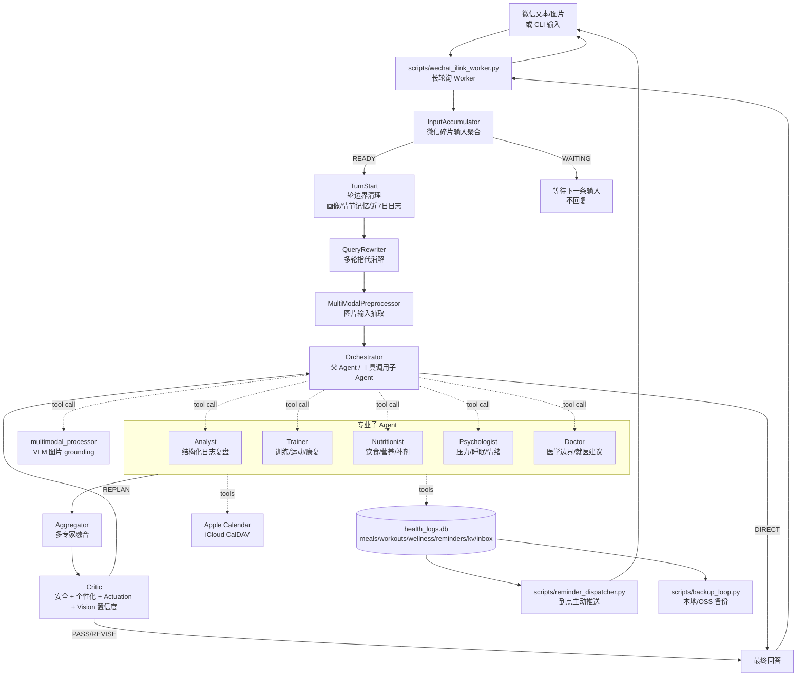

# Wellness Copilot

Wellness Copilot 是一个面向个人健康管理的 LangGraph 多 Agent 系统。它不是“把问题丢给一个 LLM 回答”的聊天 Demo，而是把多专家协作、长期记忆、RAG 证据检索、通用多模态图片理解、结构化日志、真实提醒、Apple Calendar 日程写入、微信入口、备份和 Docker 常驻部署串成一个可实际运行的健康助手。

一句话面试版：

> 这是一个有真实 side effect 的健康管理 Agent。它能在 CLI 或微信里理解文本/图片问题，按需调训练、营养、心理、医学、日志分析等专家，读写长期画像和健康日志，设置微信提醒或写入 Apple Calendar，并用 Critic 校验安全性、个性化落地和“有没有真的执行工具”。
>
> 2026-05-21 端到端评测基线：53 条覆盖训练、营养、医学、心理、多专家、多轮和执行场景的样本，273/273 条 deterministic assertions 通过，专家路由命中率 98.1%，LLM-as-Judge 综合均分 4.642/5，安全维度 4.981/5。

## 技术亮点与工程深度

这一节放在最前面，方便面试或简历项目介绍时直接讲重点。

2026-05-21 端到端主评测基线（`reports/output_eval_report_20260521-193421.json`，`eval/output_eval_dataset.jsonl`，LLM-as-Judge 开启）：

| 指标 | 结果 |
|---|---:|
| 样本规模 | 53 条 |
| Deterministic assertions | 273/273 通过，100% |
| 专家路由命中 | 52/53，98.1% |
| LLM-as-Judge 综合均分 | 4.642 / 5 |
| 相关性 / 安全性 / 连贯性 | 5.000 / 4.981 / 4.981 |
| 多轮 / 多专家 / 营养类均分 | 4.76 / 4.72 / 4.71 |
| 寒暄边界 RAG 跳过 | 4/4，100% |
| 画像量化检查 | 17/17，100% |

### 1. 从“聊天机器人”推进到“可执行 Agent 系统”

普通健康问答只能给建议，这个项目把建议落到真实执行面：

- `log_meal`、`log_workout`、`log_wellness_checkin` 写入 SQLite 健康日志。
- `push_reminder` 写入 durable reminder 队列，由独立 dispatcher 到点主动推送微信。
- `schedule_workout` / `schedule_calendar_event` 通过 iCloud CalDAV 写入 Apple Calendar。
- 所有真实 side effect 都返回统一的 `[ACTUATION]` JSON 流水。
- Aggregator 和 Critic 只有在 `actuation_log` 中看到 `ok=true` 的对应流水时，才允许最终回答说“已记录 / 已设提醒 / 已加入日历”。

这个设计解决了 Agent 常见的“嘴上说做了，实际没做”的问题。LLM 的语言承诺必须和工具执行结果一致。

这部分不是只靠人工 demo 验证：当前端到端评测中，包含真实执行链路的输出断言全部通过；专门的 `actuation` 样本 LLM-as-Judge 得分 4.6/5，全量 273 条 deterministic assertions 没有失败项。

### 2. 真正的父 Agent 调子 Agent，而不是静态路由表

Orchestrator 是父 Agent，它把子专家封装成 LangChain tools：

- `consult_analyst`
- `consult_trainer`
- `consult_nutritionist`
- `consult_psychologist`
- `consult_doctor`

父 Agent 可以在同一个 tool-use loop 里连续调用多个专家，也可以对简单问题直接回答。代码里还保留 deterministic guards：身体不适、医疗边界、心理危机、提醒/日历、日志复盘等高确定性场景会直接触发对应专家，降低纯 LLM 路由漂移。

面试可讲的点：这个项目不是“Planner 输出专家名，然后 Dispatcher 硬执行”的模板，而是让父 Agent 在真实工具调用循环里完成任务分解、信息收集和结果整合。

评测里 53 条端到端样本的专家路由命中 52 条，命中率 98.1%。从实际 tool trace 看，系统共触发 64 次专家咨询调用：Nutritionist 22 次、Trainer 18 次、Psychologist 13 次、Doctor 8 次、Analyst 3 次，说明不是静态单路由，而是在多场景下真的调度了不同专家。

### 3. 面向健康场景的多专家职责隔离

健康问题天然跨域，例如“这餐够不够支撑今晚腿训，晚上提醒我补蛋白”至少涉及：

- 餐食营养估算：Nutritionist。
- 训练负荷和恢复：Trainer。
- 真实提醒写入：push_reminder。
- 历史日志复盘：Analyst。
- 最终安全审核：Critic。

项目把不同专家的工具权限、RAG namespace、提示词边界和安全职责拆开：

- Trainer 负责训练、运动动作、TDEE/BMR、比赛训练、伤病/康复期负荷。
- Nutritionist 负责饮食、热量、蛋白质、补剂、食谱和餐食记录。
- Psychologist 负责压力、睡眠、焦虑、动力下降、心理危机边界。
- Doctor 负责一般医学建议、症状风险分层、就医建议、用药/处方边界。
- Analyst 只读结构化日志，输出趋势和复盘。

这种职责隔离让复杂 prompt 变成多个可控子系统，降低单 Agent 失控概率。

在端到端输出质量上，多专家类 8 条样本均分 4.72/5，多轮类 5 条样本均分 4.76/5，营养、心理、训练、医学类分别达到 4.71/5、4.69/5、4.60/5、4.57/5。也就是说，多 Agent 拆分没有只停留在架构图里，而是在跨域场景里保持了可评测的回答质量。

### 4. 子 Agent 输入隔离与 scratchpad 汇总

子 Agent 不直接读取完整历史，也不互相读取原始工具 trace。Orchestrator 给每个专家构造裁剪后的上下文：

- 本轮独立问题：来自 `QueryRewriter` 的 `contextualized_query`。
- 用户画像快照：来自 `TurnStart` 构造的 `personalization_ctx`。
- 情节记忆：来自 `episode_context`。
- 近期日志摘要：来自 `recent_logs_summary`。
- 图片 grounding：来自 `vision_extractions`。
- 同伴要点：通过 `format_peer_notes` 传递 scratchpad。

这样减少 token 成本，也防止某个专家看到不该看的领域信息。Aggregator 和 Critic 看到的是结构化专家结果和 scratchpad，而不是一堆混乱 tool trace。

### 5. LangGraph 持久化状态的“轮边界清理”

LangGraph checkpoint 会跨进程保存完整状态，这很强，但也容易出 bug：如果 reducer 只是 append 或 merge，上轮的 `agent_notes`、`expert_responses`、`actuation_log` 会残留到下一轮，导致 Aggregator/Critic 误判。

项目在 `wellness_copilot/state.py` 里实现了 turn-scoped reducer：

- `_turn_dict`：支持 `{ "__RESET__": true }` 清空本轮 dict。
- `_turn_list`：支持 list 首项 `RESET_SENTINEL` 清空本轮 list。
- `_turn_int`：支持 `("__RESET__", 0)` 重置计数器。

`TurnStart` 每轮清空：

- `agent_notes`
- `expert_responses`
- `last_tools`
- `image_inputs`
- `vision_extractions`
- `actuation_log`
- `retrieval_hits`
- `plan / executed / next / replan_count`
- `draft_answer / critic_verdict / replan_context`

这是长会话 Agent 工程里非常实际的坑：不做轮边界清理，系统会“带着上一轮的幻觉继续判断”。

### 6. 个性化不是“贴画像”，而是可检查的决策点

项目不会只把 profile 粘进 prompt，而是生成 personalization decision points，让专家、Aggregator 和 Critic 都围绕这些点检查是否落地：

- 年龄、身高、体重：用于 TDEE、心率区间、蛋白质 g/kg、热量缺口等推导。
- 伤病、术后、康复期：用于动作禁忌、替代动作、进阶门槛和就医边界。
- 饮食偏好、过敏、乳糖不耐：用于食材替换和风险提醒。
- 压力源、睡眠状态：用于睡前流程、压力管理和心理支持。

Critic 会检查回答是否真正把画像转成了方案差异，而不是只说“根据你的情况”。

端到端评测专门设置了 17 个需要画像转成量化建议的检查点，deterministic 检查 17/17 通过；profile echo 边界样本 4/4 通过，避免模型把画像信息生硬复述给用户。LLM-as-Judge 中个性化维度当前为 3.698/5，是后续继续提升的主要方向，也让项目能讲清楚“指标发现了什么问题”。

### 7. RAG 是本地两阶段检索，不依赖云向量数据库

`wellness_copilot/rag.py` 实现了本地知识库：

- 支持 `.md`、`.txt`、`.pdf`、`.docx`。
- 每个专家独立 namespace：trainer、nutritionist、psychologist、doctor、safety。
- Chunking 不是简单固定窗口：先按标题层级、段落、列表项和表格做结构化切分；只有单个结构块过长时才 fallback 到 `chunk_size`，并保留 overlap。
- PDF 有专门的文本恢复层：自动选择 `pypdf` 的 plain/layout 抽取结果，合并中英文硬换行，清理页眉页码，识别章节标题、`小贴士`、英文标题和 bullet list。
- PDF citation 仍保留页码：chunk 文本可以带章节标题作为语义前缀，但 `page_range` 只按正文块计算，避免标题所在页污染引用页码。
- PDF child chunk 默认更细：PDF 结构块 max length 收敛到 `RAG_PDF_FINE_CHUNK_MAX_CHARS=320`，列表项/表格尽量独立成块。
- Stage 1：`BAAI/bge-m3` dense retrieval + FAISS，并融合轻量 BM25 lexical candidates。
- 长 PDF 的 parent-child 改为 gated rescue：只有候选池里 PDF 证据不足且 section parent 分数达标时，才把章节内 child chunks 补进候选池。
- Stage 2：`BAAI/bge-reranker-v2-m3` cross-encoder rerank。
- 索引缓存包含 chunks、meta、FAISS index 和 fingerprint。
- fingerprint 绑定文档内容、chunk 参数、chunker version 和 embedding 模型，避免错误复用旧索引。
- RAG 工具是 on-demand 的，专家决定是否检索；寒暄、纯记录和低风险直接回答不会乱打检索。

这套设计体现的是可控、可离线、可回归测试的 RAG，而不是单纯调用外部 search。

端到端评测也覆盖了 RAG on-demand 边界：寒暄边界样本 4/4 没有误触发检索，全量样本平均 RAG 调用 0.08 次/轮，说明系统不会为了“显得复杂”在低价值场景浪费检索和 token。

当前均衡主评测基线（`reports/rag_eval_report_20260521-175205.json`，196 条 LLM 生成样本，覆盖 5 个专家 namespace，ground truth 校验 100% 通过）：

| 阶段 | MRR | Recall@1 | Recall@3 | Recall@5 | Recall@10 | Recall@20 |
|---|---:|---:|---:|---:|---:|---:|
| Embedding / Hybrid Retrieve | 0.8169 | - | - | 0.9133 | 0.9694 | 1.0000 |
| Cross-Encoder Rerank | 0.9060 | 0.8469 | 0.9694 | 0.9898 | - | - |

Rerank 相比第一阶段带来稳定增益：`MRR +0.0891`、`Recall@5 +0.0765`，说明两阶段架构不只是“能召回”，还能把正确 chunk 稳定推到 LLM 上下文前排。

### 8. 通用多模态 grounding，而不是只识别餐盘

图片不会在一进图时就强行调用 VLM。流程是：

1. `MultiModalPreprocessor` 只提取本轮图片输入，写入 `image_inputs`。
2. Orchestrator 判断是否需要看图。
3. 如需要，调用 `multimodal_processor` 工具，让 VLM 根据用户 query 生成面向问题的文字 grounding。

它可以处理：

- 餐食图片：估算食物、热量、蛋白、碳水、脂肪和置信度。
- 训练动作/姿势：交给 Trainer 分析动作和风险。
- 身体部位、伤口、皮疹、化验单、药品包装：交给 Doctor 做风险边界。
- 配料表、营养成分表：交给 Nutritionist 解释。

Vision 置信度会进入 Critic：当 `confidence < 0.5`，最终回答不能用确定语气输出精确热量或宏量营养素。

### 9. 微信入口不是简单转发，而是碎片输入聚合

微信用户经常先发图，再发一句“帮我看看”；或者把一句话拆成多条。项目在两层做了处理：

- `scripts/wechat_ilink_worker.py` 有 inbox FIFO，先把微信消息持久化到 SQLite。
- `InputAccumulator` 在 LangGraph 内缓存碎片输入，等问题/命令完整后再进入正式流程。

因此：

- 单独发图不会立刻浪费 VLM 调用。
- “图 + 说明”可以合并成一轮完整 HumanMessage。
- `/bind <user_id>` 可把微信 wxid 绑定到项目内部用户 ID，复用已有 profile/memory/logs。
- worker offset、context_token 等轻量状态写入 `kv` 表，支持重启恢复。

### 10. 部署是常驻服务，而不是 notebook demo

Docker Compose 提供三个长期运行服务：

- `worker`：微信长轮询，下载图片，调用 graph，回复用户。
- `dispatcher`：扫描 `reminders`，到点主动推送。
- `backup`：周期性备份 SQLite/JSON/reports，可选上传 OSS。

持久化策略：

- `./data` 保存 checkpoints、health logs、profile、episode、session、backups。
- `./data/.hf_cache` 保存 HuggingFace 模型缓存。
- `./knowledge_base` bind mount，服务器上修改知识库不用重建镜像。
- `.dockerignore` 排除 `.env`、SQLite、WAL/SHM、日志、缓存、tmp、备份，避免本地运行态进入镜像。

### 11. 可观测性、评测和回归

项目保留了多层评测脚本：

- `scripts/evaluate_output.py`：端到端输出评测，支持 deterministic assertions 和 LLM-as-Judge。
- `scripts/evaluate_rag.py`：RAG 两阶段检索评测。
- `scripts/evaluate_architecture.py`：架构专项评测。
- smoke tests：coreference、dynamic replan、critic scratchpad、plan execute 等。

这让项目可以讲清楚“怎么证明系统没退化”，而不是只靠主观 demo。

当前输出评测还记录了性能画像：53 条样本共 92 次 LLM 调用，平均 1.74 次/样本；平均 4058 tokens/样本，p50 为 2989 tokens；端到端耗时 p50 为 8.9s、p95 为 59.5s。报告同时保留 node/component 级 token、耗时和 LLM 调用分布，方便定位是 Orchestrator、Aggregator、Critic 还是检索链路造成成本上升。

## 开箱使用指引

下面按“最小可跑 -> 可选能力 -> Docker/ECS”组织。

### 0. 准备环境

推荐：

- Python 3.10+，本地开发建议用 conda。
- Docker Compose v2，用于服务器部署。
- 出站 HTTPS 网络，用于 LLM、WeChat iLink、iCloud CalDAV、HuggingFace/model mirror、可选 OSS。

克隆后先复制配置：

```bash
cp .env.example .env
```

`.env` 包含密钥，请不要提交到 Git。

### 1. 本地最小文本版

只需要 LLM，就能跑 CLI 纯文本健康咨询：

```bash
conda env create -f environment.yml
conda activate wellness-copilot
pip install -r requirements.txt
```

编辑 `.env`，至少填写：

```env
LLM_BASE_URL=https://api.openai.com/v1
LLM_API_KEY=your_api_key
LLM_MODEL=gpt-5.5-mini
LLM_API_MODE=responses
```

如果服务商只兼容 Chat Completions：

```env
LLM_API_MODE=chat_completions
```

初始化 SQLite 健康日志：

```bash
python -c "from wellness_copilot.integrations.local_logs import init_db; init_db()"
```

启动 CLI：

```bash
python main.py --mode cli --detail
```

`--detail` 会打印专家调用和工具使用，适合调试和面试演示。

### 2. 可选：给 Orchestrator 单独配置更强模型

默认 Orchestrator 继承 `LLM_*`。如果想让父 Agent 用更强模型做工具决策：

```env
ORCHESTRATOR_LLM_BASE_URL=https://api.openai.com/v1
ORCHESTRATOR_LLM_API_KEY=your_api_key
ORCHESTRATOR_LLM_MODEL=gpt-5.5
ORCHESTRATOR_LLM_API_MODE=responses
ORCHESTRATOR_LLM_OUTPUT_VERSION=responses/v1
```

### 3. 可选：启用多模态图片理解

```env
MULTIMODAL_LLM_ENABLED=true
MULTIMODAL_LLM_PROVIDER=openai
MULTIMODAL_LLM_BASE_URL=https://api.openai.com/v1
MULTIMODAL_LLM_API_KEY=your_api_key
MULTIMODAL_LLM_MODEL=gpt-4o-mini
MULTIMODAL_LLM_API_MODE=chat_completions
```

未配置时，图片能力会安全降级，不影响纯文本运行。

### 4. 可选：启用 Apple Calendar / iCloud CalDAV

Apple Calendar 使用 Apple ID 的 App 专用密码，不要填写 Apple ID 主密码。生成入口：

```text
https://account.apple.com/account/manage
```

`.env` 示例：

```env
ICLOUD_USERNAME=your_apple_id@example.com
ICLOUD_APP_SPECIFIC_PASSWORD=xxxx-xxxx-xxxx-xxxx
ICLOUD_CALDAV_URL=https://caldav.icloud.com
ICLOUD_CALENDAR_NAME=Calendar
```

验证连接和日历选择：

```bash
python scripts/setup_icloud_caldav.py
```

可用后，用户说“帮我把明晚 7 点跑步加入 Apple Calendar”，Trainer 会调用 `schedule_workout` 真正写入日历。

### 5. 可选：微信入口和主动提醒

首次登录：

```bash
python scripts/wechat_login.py --terminal-qr
```

启动 worker 和提醒 dispatcher：

```bash
python scripts/wechat_ilink_worker.py
python scripts/reminder_dispatcher.py
```

说明：

- `wechat_login.py` 会扫码获取 `WECHAT_BOT_TOKEN` 并写回 `.env`。
- worker 长轮询微信消息，调用 LangGraph，并回复用户。
- dispatcher 扫描 `reminders` 表，到点主动推送。
- 微信用户会自动绑定到稳定项目用户 ID，默认形如 `wechat_<hash>`。
- 如需手动绑定当前微信到已有项目用户，可发送 `/bind Michael`，或本地执行：

```bash
python scripts/wechat_bind_user.py --wxid '<user_wxid>' --user-id Michael
python scripts/wechat_bind_user.py --list
```

### 6. Docker Compose 本地或 ECS 部署

先准备目录和配置：

```bash
cp .env.example .env
vim .env
mkdir -p data logs reports tmp
chmod 600 .env
docker compose config --quiet
```

启动：

```bash
docker compose up -d --build
docker compose logs -f worker dispatcher backup
```

容器内首次微信扫码：

```bash
docker compose exec worker python scripts/wechat_login.py --env /app/.env --qr-path /app/tmp/wechat_qrcode.png --terminal-qr --no-open
docker compose restart worker
```

容器内 Apple Calendar 校验：

```bash
docker compose exec worker python scripts/setup_icloud_caldav.py
```

容器内 smoke checks：

```bash
docker compose exec worker python -c "from wellness_copilot.integrations.local_logs import init_db; init_db(); print('db ok')"
docker compose exec worker python -c "from wellness_copilot.graph import graph; print('graph ok')"
docker compose exec dispatcher python scripts/reminder_dispatcher.py --once
```

如果 ECS 区域访问默认国内镜像源不顺，可以覆盖 build args：

```bash
docker compose build \
  --build-arg PYTHON_BASE_IMAGE=python:3.11-slim \
  --build-arg DEBIAN_MIRROR=http://deb.debian.org/debian \
  --build-arg DEBIAN_SECURITY_MIRROR=http://deb.debian.org/debian-security \
  --build-arg PIP_INDEX_URL=https://pypi.org/simple
docker compose up -d
```

更详细部署和迁移见：

- `deploy/README.md`
- `deploy/MIGRATION.md`

## 核心架构



## LangGraph 流程

入口定义在 `wellness_copilot/graph.py`。

| 节点 | 作用 |
|---|---|
| `InputAccumulator` | 微信碎片输入聚合。CLI/评测直接 READY；微信可 WAITING。 |
| `TurnStart` | 清理本轮状态，加载 profile、episode、recent logs，必要时压缩长历史。 |
| `QueryRewriter` | 多轮指代消解，生成独立问题。 |
| `MultiModalPreprocessor` | 文本 no-op；图片轮只提取图片输入，不立刻调用 VLM。 |
| `Orchestrator` | 父 Agent，直接回答或调用子专家工具；也可调用 `multimodal_processor`。 |
| `Aggregator` | 多专家结果融合成统一口吻草稿。 |
| `Critic` | 安全、个性化、actuation、vision 置信度审核；可 PASS/REVISE/REPLAN。 |

Orchestrator 后的条件边：

- 如果是 direct answer，直接结束。
- 如果调用了子专家，进入 Aggregator。
- 如果已有草稿需要审核，进入 Critic。
- Critic 若写入 `replan_context`，回到 Orchestrator 补叫专家；否则结束。

## 关键模块

| 路径 | 作用 |
|---|---|
| `wellness_copilot/graph.py` | LangGraph 拓扑、checkpoint、条件边。 |
| `wellness_copilot/state.py` | AgentState 与 turn-scoped reducer。 |
| `wellness_copilot/agents/input_accumulator.py` | 微信碎片输入聚合。 |
| `wellness_copilot/agents/turn_start.py` | 轮边界清理、长历史摘要、画像/情节记忆/日志摘要加载。 |
| `wellness_copilot/agents/query_rewriter.py` | 多轮问题改写。 |
| `wellness_copilot/agents/multimodal_preprocessor.py` | 图片输入解析；VLM 调用由 Orchestrator 工具按需触发。 |
| `wellness_copilot/agents/orchestrator.py` | 父 Agent、确定性安全 guard、子 Agent 工具封装。 |
| `wellness_copilot/agents/analyst.py` | 读取健康日志，输出趋势与复盘。 |
| `wellness_copilot/agents/trainer.py` | 训练、动作、运动恢复、TDEE/BMR、比赛训练。 |
| `wellness_copilot/agents/nutritionist.py` | 饮食、营养、热量、蛋白质、补剂、食谱。 |
| `wellness_copilot/agents/psychologist.py` | 压力、睡眠、情绪、动力、心理安全边界。 |
| `wellness_copilot/agents/doctor.py` | 医学资料、症状风险、就医建议、用药边界。 |
| `wellness_copilot/agents/aggregator.py` | 多专家回答融合。 |
| `wellness_copilot/agents/critic.py` | 最终审核、REVISE、REPLAN、Actuation/Vision 规则。 |
| `wellness_copilot/tools.py` | RAG 工具、画像工具、健康日志工具统一出口。 |
| `wellness_copilot/rag.py` | 本地知识库、chunk、embedding、FAISS、rerank、缓存。 |
| `wellness_copilot/integrations/local_logs.py` | SQLite 健康日志、提醒、微信 inbox、用户绑定。 |
| `wellness_copilot/integrations/apple_calendar.py` | iCloud CalDAV / Apple Calendar 日程写入。 |
| `wellness_copilot/integrations/vision.py` | OpenAI-compatible VLM helper。 |
| `wellness_copilot/integrations/wechat_ilink.py` | 微信 iLink / ClawBot 风格 HTTP client。 |
| `scripts/wechat_ilink_worker.py` | 微信长轮询 worker。 |
| `scripts/reminder_dispatcher.py` | 到点提醒 dispatcher。 |
| `scripts/backup_loop.py` | SQLite/JSON/reports 备份，可选 OSS 上传。 |
| `docker-compose.yml` | worker / dispatcher / backup 常驻部署。 |

## 配置速查

| 配置 | 必填 | 说明 |
|---|---|---|
| `LLM_BASE_URL` | 是 | 默认文本 LLM 的 OpenAI-compatible endpoint。 |
| `LLM_API_KEY` | 是 | 默认文本 LLM key。 |
| `LLM_MODEL` | 是 | 默认文本模型。 |
| `LLM_API_MODE` | 建议 | `responses` 或 `chat_completions`。 |
| `ORCHESTRATOR_LLM_*` | 否 | 父 Agent 独立模型；留空继承 `LLM_*`。 |
| `MULTIMODAL_LLM_*` | 否 | VLM 图片 grounding。未配置可纯文本运行。 |
| `ICLOUD_*` | 否 | Apple Calendar / iCloud CalDAV。 |
| `WECHAT_*` | 否 | 微信入口和主动推送。 |
| `MCP_*` | 否 | 可选社区 MCP 工具服务器，默认关闭。 |
| `RAG_*` | 否 | 本地 embedding/rerank 配置。 |
| `OSS_*` | 否 | 备份上传对象存储。 |

### LLM 调用入口速查

| 脚本 / 入口 | 是否会调用在线 LLM | 使用的配置 | 说明 |
|---|---:|---|---|
| `main.py --mode cli` | 是 | `LLM_*` + `ORCHESTRATOR_LLM_*`；图片轮按需 `MULTIMODAL_LLM_*` | 本地 CLI 主入口。`LLM_*` 供 QueryRewriter、TurnStart、专家、Aggregator、Critic、ReplanJudge 使用；Orchestrator 可单独覆盖。 |
| `scripts/wechat_ilink_worker.py` | 是 | `LLM_*` + `ORCHESTRATOR_LLM_*`；图片轮按需 `MULTIMODAL_LLM_*` | 微信长轮询 worker，完整调用 LangGraph。 |
| `scripts/evaluate_output.py` | 是 | 被测 Agent 用 `LLM_*` + `ORCHESTRATOR_LLM_*`；judge 用 `JUDGE_*` | 端到端输出评测。`--no-judge` 只跳过 judge，仍会运行 Agent 本身。`JUDGE_BASE_URL` 留空时 judge fallback 到 `LLM_*` 并打印 warning。 |
| `scripts/evaluate_architecture.py` | 是 | `LLM_*` + `ORCHESTRATOR_LLM_*` | 架构回归评测，会运行 LangGraph；部分断言还 monkey-patch prompt/runner 做观测。 |
| `scripts/generate_eval_dataset.py` | 生成时是；`--dry-run` 否 | `EVAL_DATASET_LLM_*`，留空继承 `LLM_*` | RAG 评测集生成专用。真正生成 query 和默认二次质检时调用 LLM；chunk 收集和 dry-run 不需要 LLM key。 |
| `scripts/smoke_coreference.py` | 是 | `LLM_*` + `ORCHESTRATOR_LLM_*` | 跑完整 graph 的多轮指代 smoke。 |
| `scripts/smoke_critic_scratchpad.py` | 是 | `LLM_*` + `ORCHESTRATOR_LLM_*` | 跑完整 graph，检查 Critic/scratchpad。 |
| `scripts/smoke_personalization.py` | 是 | `LLM_*` + `ORCHESTRATOR_LLM_*` | 跑完整 graph，检查画像落地。 |
| `scripts/smoke_plan_execute.py` | 是 | `LLM_*` + `ORCHESTRATOR_LLM_*` | 跑完整 graph，检查计划执行链路。 |
| `scripts/smoke_error_fallbacks.py` | 多数用 stub；导入仍需 `LLM_*` 可构造 | `LLM_*` | 故障注入测试会替换部分模块的 LLM，但导入 agent 模块时仍会创建默认 LLM client。 |
| `scripts/smoke_dynamic_replan.py` | 否 | 无文本 LLM API | 使用 stub graph / stub LLM，不发在线请求。 |
| `scripts/smoke_personalization_decision_points.py` | 否 | 无文本 LLM API | 纯规则函数检查。 |
| `scripts/smoke_mcp_tools.py` | 否 | 无文本 LLM API | 只测 MCP 工具连接/调用。 |
| `scripts/smoke_semantic_episode.py` | 否；可能加载 embedding | `RAG_*` / episode semantic 配置 | 测 episode 语义召回，使用本地 embedding，不调用文本 LLM。 |
| `scripts/evaluate_rag.py` | 否 | `RAG_*` | 只评 embedding/rerank 两阶段检索，不调用文本 LLM。 |
| `scripts/build_rag_index.py` | 否 | `RAG_*` | 构建本地 embedding/FAISS/rerank 缓存，不调用文本 LLM。 |
| `scripts/compare_embedders.py` | 否 | `RAG_*` / HF 模型 | 比较 embedding 模型，不调用文本 LLM。 |
| `scripts/download_rag_models.py` | 否 | HF / `RAG_*` 相关缓存 | 预下载本地 RAG 模型。 |
| `scripts/download_knowledge_corpus.py` | 否 | HTTP 数据源 | 下载/更新知识库语料，不调用文本 LLM。 |
| `scripts/daily_morning_briefing.py` | 否 | SQLite / WeChat push | 读取日志和推送早报，不调用文本 LLM。 |
| `scripts/reminder_dispatcher.py` | 否 | SQLite / WeChat push | 到点提醒派发。 |
| `scripts/backup_loop.py` / `scripts/restore_backup.py` | 否 | 本地路径 / `OSS_*` | 备份恢复。 |
| `scripts/wechat_login.py` / `scripts/wechat_bind_user.py` | 否 | `WECHAT_*` / SQLite | 微信登录或用户绑定。 |
| `scripts/setup_icloud_caldav.py` | 否 | `ICLOUD_*` | CalDAV 连接验证。 |
| `scripts/setup_mcp_servers.sh` / `scripts/smoke_mcp_tools.py` | 否 | `MCP_*` / Node/npm | MCP 安装和工具 smoke。 |
| `scripts/migrate_episode_index.py` | 否；可能加载 embedding | `RAG_*` / episode index 路径 | 迁移或重建 episode 语义索引。 |

运行建议：

- 只想测 RAG 检索质量：跑 `evaluate_rag.py`，不需要 `LLM_API_KEY`。
- 想生成新的 RAG LLM 评测集：配置 `EVAL_DATASET_LLM_*`，避免占用主 Agent 模型额度。
- 想跑输出质量评测但不想多花 judge 成本：`evaluate_output.py --no-judge`；注意被测 Agent 仍会调用 `LLM_*`。
- 想跑完全离线 smoke：优先用 `smoke_dynamic_replan.py`、`smoke_personalization_decision_points.py`、`smoke_mcp_tools.py`；完整 graph smoke 需要可用 `LLM_*`。

Docker Compose 会覆盖持久化路径到 `/app/data`：

```env
SQLITE_DB_PATH=/app/data/checkpoints.db
HEALTH_LOGS_DB_PATH=/app/data/health_logs.db
OBSERVABILITY_DB_PATH=/app/data/observability.db
PROFILE_STORE_PATH=/app/data/profile_store.json
EPISODE_STORE_PATH=/app/data/episode_store.json
SESSION_STORE_PATH=/app/data/session_store.json
```

## 数据与记忆系统

### AgentState 关键字段

| 字段 | 生命周期 | 说明 |
|---|---|---|
| `messages` | checkpoint 持久 | LangGraph 消息历史，支持 `RemoveMessage` 摘要压缩。 |
| `contextualized_query` | 每轮覆盖 | QueryRewriter 输出的独立问题。 |
| `personalization_ctx` | 每轮覆盖 | 本轮统一用户画像快照。 |
| `episode_context` | 每轮覆盖 | 最近/语义相关对话摘要。 |
| `recent_logs_summary` | 每轮覆盖 | 近 7 日 SQLite 健康日志摘要。 |
| `pending_input_fragments` | 跨微信碎片 | 微信未完成输入的临时 buffer。 |
| `input_accumulator_status` | 每轮覆盖 | `WAITING` / `READY`。 |
| `image_inputs` | turn-scoped | 本轮图片列表。 |
| `vision_extractions` | turn-scoped | 本轮 VLM 图片 grounding / 餐食估算。 |
| `expert_responses` | turn-scoped | 子 Agent 回答。 |
| `agent_notes` | turn-scoped | 子 Agent scratchpad 要点。 |
| `actuation_log` | turn-scoped | 本轮真实 side effect 流水。 |
| `draft_answer` | 每轮覆盖 | Aggregator 或 Orchestrator 交给 Critic 的草稿。 |
| `critic_verdict` | 每轮覆盖 | PASS / REVISE / REPLAN / 规则命中原因。 |

### 三层记忆 + 一层行为日志

1. **Profile memory**：`profile_store.json`
   - 年龄、身高、体重、伤病、饮食偏好、压力源、回答风格。
   - 由 `set_physical_stats`、`add_injury`、`set_dietary_goal` 等工具更新。

2. **Episode memory**：`episode_store.json`
   - 每轮 query、experts、gist、facts。
   - 支持最近 N 轮召回和语义相似召回。

3. **Checkpoint memory**：`checkpoints.db`
   - LangGraph SqliteSaver 保存 thread 状态。
   - 支持跨进程恢复和长会话继续。

4. **Structured health logs**：`health_logs.db`
   - 餐食、训练、恢复/情绪、提醒、微信 inbox、用户绑定、kv。
   - 不混入 profile，避免长期画像和每日行为数据语义混乱。

### Health Logs Schema

主要表：

- `meals(id, user_id, date_iso, items_json, kcal, protein_g, carbs_g, fat_g, source, idempotency_key, created_at)`
- `workouts(id, user_id, date_iso, plan_json, status, idempotency_key, created_at)`
- `wellness(id, user_id, date_iso, sleep_h, mood, notes, idempotency_key, created_at)`
- `reminders(id, user_id, target_wxid, context_token, remind_at_iso, remind_at_epoch, text, priority, delivered, delivered_at, idempotency_key, created_at)`
- `kv(key, value, updated_at)`
- `wechat_inbox(update_id, user_wxid, context_token, chat_type, text, media_ids_json, raw_json, status, created_at, processed_at)`
- `wechat_user_bindings(wechat_wxid, project_user_id, display_name, created_at, updated_at)`

写入设计：

- mutating tool 都接受 `idempotency_key`。
- SQLite 使用 `UNIQUE(idempotency_key)` + `INSERT OR IGNORE`。
- 启用 WAL 和 `busy_timeout=5000`，适配 worker / dispatcher 同时访问。

## RAG 检索系统

知识库目录：

- `knowledge_base/trainer`
- `knowledge_base/nutritionist`
- `knowledge_base/psychologist`
- `knowledge_base/doctor`
- `knowledge_base/safety`

两阶段检索：

1. **文档读取**
   - 支持 `.md`、`.txt`、`.pdf`、`.docx`。
   - PDF 使用 `pypdf`，逐页保留 `page_range` 映射；docx 提取段落和表格。
   - PDF 会自动选择 plain/layout 抽取结果，跳过异常膨胀的 layout 输出。

2. **Chunking**
   - 优先按文档结构切分：Markdown 标题层级、段落、列表项和表格。
   - PDF 会先做结构恢复：合并硬换行、清理页眉页码、识别中文章节/小贴士/英文标题/bullet。
   - 默认 `chunk_size=420` 作为结构块过长时的 fallback max length，`overlap=100`。
   - PDF 默认启用更细 child chunk：`RAG_PDF_FINE_CHUNK_MAX_CHARS=320`，并尽量让列表项、表格块独立进入 child chunk，减少一个 chunk 混入多个局部事实。
   - fallback 时使用中英文句末标点软边界，保留 source、chunk_id、PDF page_range；标题可作为语义前缀，但页码只按正文块计算。

3. **Dense Retrieval**
   - 默认 embedding：`BAAI/bge-m3`。
   - 默认 Top-K：`RAG_RETRIEVE_TOP_K=12`。
   - 向量检索使用 `faiss-cpu`；同时构建无依赖 BM25 lexical index，默认 `RAG_HYBRID_RETRIEVAL_ENABLED=true`。
   - Hybrid retrieval 会把 dense Top-K 与 BM25 Top-K 融合后进入 rerank pool，改善数字、食物名、专有名词、列表项等精确词召回。
   - PDF 会额外建立 section parent 索引；parent-child 现在默认走 gated rescue：候选池里 PDF chunk 不足且最佳 parent 分数达到 `RAG_PDF_PARENT_RESCUE_MIN_PARENT_SCORE=0.56` 时，才补入该章节内最相关的 child chunks。
   - parent expansion、gated rescue、parent rerank context、parent score fusion 都可分别用开关做 ablation；当前默认关闭 parent excerpt 注入 reranker，并将 parent score fusion 保持在低权重 `RAG_PDF_SECTION_SCORE_WEIGHT=0.05`。
   - Rerank pool 与可见 stage1 Top-K 分离：默认把 hybrid child candidates 和 gated parent rescue candidates 合并到最多 30 条候选，再交给 reranker，控制同源干扰项数量。

4. **Cross-Encoder Rerank**
   - 默认 reranker：`BAAI/bge-reranker-v2-m3`。
   - 默认最终返回：`RAG_FINAL_TOP_K=4`。
   - PDF reranker 输入默认只带 `section_path` 和 child chunk；如需实验 parent excerpt，可设置 `RAG_PDF_PARENT_RERANK_CONTEXT_ENABLED=true`。
   - 最终返回 PDF 命中时会补前后相邻 chunk 作为上下文；默认 `RAG_PDF_NEIGHBOR_CHUNKS=1`。

5. **索引缓存**
   - 每个知识库目录维护 `.index_cache`。
   - 缓存 chunks/meta/FAISS/section parents/fingerprint。
   - fingerprint 绑定文档内容、chunk 参数、chunker version 和 embedding 模型。

仓库中保留的报告示例：

- `reports/rag_index_stats.json`
- `reports/rag_eval_report_small.json`
- `eval/rag_eval_dataset_v2.jsonl`

### RAG 评测集生成与评测

RAG 评测有三类数据集：

- 手工/阶段性维护集：`eval/rag_eval_dataset.jsonl`、`eval/rag_eval_dataset_v2.jsonl`。
- LLM 自动生成集：用当前 `knowledge_base` 的高质量 chunk 反向生成中文 query，并写入 `relevant_chunk_ids`。
- 真实用户查询集：如果有线上日志，建议抽样脱敏后混入评测集，用来校正 LLM 生成查询的分布偏差。

生成脚本复用 `LocalKnowledgeBase` 的文档读取和切分逻辑，但不会在 dry-run 或收集 chunk 阶段加载 embedding/rerank 模型；只有真正生成 query 和二次质检时才调用 `EVAL_DATASET_LLM_*`。这组配置留空时会继承 `LLM_*`，也可以单独换成更便宜、适合批量生成 query 的模型。

为避免长 PDF/书籍压倒短文档，生成脚本默认先对每个源文件做预抽样：单文件切出超过 10 个 chunk 时，先随机保留 10 个，再汇入所有文件的大池子做质量过滤和全局 `--max-chunks` 抽样。需要关闭时可设 `--max-chunks-per-file 0`。

LLM 反向生成的样本不是“天然正确”的真值。当前脚本默认做几道质量门：

- 生成前过滤短片段、目录/参考文献、URL 密集、低信息密度或无句界 chunk。
- 生成时要求输出 `query`、`answer`、`supporting_span`、`question_type`、`difficulty`，并约束问题不要照抄原文关键短语/数字。
- 生成后做字面重叠检测、`supporting_span` 回溯检测、去重、轻量 BM25 难度检查。
- 默认再用 LLM 二次判断可回答性、supporting span 是否成立、是否高泄漏；但会先做本地过滤，只把可能入选的候选和少量 buffer 送去二次质检，避免把所有原始候选再喂一遍 LLM。
- 成本敏感时优先用 `--fast`，它等价于 `--candidate-multiplier 1 --no-llm-verify`；脚本会在生成前打印 LLM 调用数和 prompt 字符数预估。

当你改了专家种类、知识库文件、chunk 参数或大幅更新语料时，建议先重新生成一版 LLM 评测集：

```bash
# 小样本试跑：只抽 20 个 chunk，不调用 LLM，检查 namespace 和切分分布
python scripts/generate_eval_dataset.py \
  --max-chunks 20 \
  --max-chunks-per-file 10 \
  --dry-run

# 成本敏感的试生成：单轮 LLM 生成 + 本地过滤，适合快速观察改进效果
python scripts/generate_eval_dataset.py \
  --max-chunks 80 \
  --max-chunks-per-file 10 \
  --questions-per-chunk 4 \
  --fast \
  --out eval/rag_eval_dataset_generated.quick.jsonl

# 高质量复核版：保留二次 LLM 质检；默认 chunk_size=420、overlap=100，与 evaluate_rag.py 对齐
python scripts/generate_eval_dataset.py \
  --max-chunks 100 \
  --max-chunks-per-file 10 \
  --questions-per-chunk 2 \
  --candidate-multiplier 2 \
  --out eval/rag_eval_dataset_generated.jsonl

# 只生成某些 namespace
python scripts/generate_eval_dataset.py \
  --agent trainer,nutritionist \
  --max-chunks 40 \
  --max-chunks-per-file 10 \
  --out eval/rag_eval_dataset_generated.tn.jsonl
```

生成脚本输出的 ground truth 使用 namespace 形式，并带可抽检的答案与质量元数据，例如：

```json
{"query":"成年人一般每天睡多久比较合适？","agent":"doctor","relevant_chunk_ids":["doctor:chronic_disease_prevention.md#chunk-2"],"relevant_sources":["doctor/chronic_disease_prevention.md"],"answer":"多数成年人每晚建议睡 7 到 9 小时。","supporting_span":"Adults should sleep 7 or more hours per night on a regular basis.","question_type":"factual","difficulty":"easy","sample_kind":"single_hop_positive","quality":{"literal_overlap":0.18,"supporting_span_trace":1.0}}
```

`evaluate_rag.py` 会在模型加载前校验这些 source/chunk 是否还存在于当前 `knowledge_base`。如果知识库改动导致 ground truth 过期，会直接报错，而不是悄悄把指标打低。

报告里同时保留严格 chunk-level 指标和长文档宽松指标：

- `embedding_stage` / `rerank_stage`：严格按 `relevant_chunk_ids` 命中，适合看引用 chunk 是否精准。
- `embedding_stage_relaxed` / `rerank_stage_relaxed`：补充 `source_hit@k`、`page_hit@k`、`same_source_near_miss@k`、`same_page_or_adjacent_chunk_hit@k`，适合判断 PDF 场景是“找错文档”还是“找对 PDF 但落在相邻 chunk/同页 chunk”。

最新均衡主评测结果（`reports/rag_eval_report_20260521-175205.json`）：

| 指标 | 结果 |
|---|---:|
| 样本数 | 196 |
| Ground truth validation | 0 unknown sources / 0 unknown chunk ids |
| Embedding MRR | 0.8169 |
| Embedding Recall@5 / @10 / @20 | 0.9133 / 0.9694 / 1.0000 |
| Rerank MRR | 0.9060 |
| Rerank Recall@1 / @3 / @5 | 0.8469 / 0.9694 / 0.9898 |
| Rerank uplift vs embedding | MRR +0.0891 / Recall@5 +0.0765 |

按专家拆分后也保持稳定：

| Agent | 样本数 | Rerank MRR | Recall@1 | Recall@5 |
|---|---:|---:|---:|---:|
| doctor | 45 | 0.9148 | 0.8444 | 1.0000 |
| nutritionist | 44 | 0.8973 | 0.8636 | 0.9773 |
| psychologist | 46 | 0.9438 | 0.9130 | 1.0000 |
| safety | 16 | 0.9688 | 0.9375 | 1.0000 |
| trainer | 45 | 0.8444 | 0.7333 | 0.9778 |

```bash
# 评测已有 v2 数据集
python scripts/evaluate_rag.py \
  --dataset eval/rag_eval_dataset_v2.jsonl \
  --out reports/rag_eval_report.json

# 评测刚生成的 LLM 数据集
python scripts/evaluate_rag.py \
  --dataset eval/rag_eval_dataset_generated.jsonl \
  --out reports/rag_eval_report.generated.json

# PDF / hybrid ablation：分别观察 BM25、fine chunk、gated rescue、rerank context
python scripts/evaluate_rag.py \
  --dataset eval/rag_eval_dataset_generated.jsonl \
  --report-label no_hybrid \
  --hybrid-retrieval off \
  --out reports/rag_eval_report.no_hybrid.json

python scripts/evaluate_rag.py \
  --dataset eval/rag_eval_dataset_generated.jsonl \
  --report-label no_pdf_fine_chunking \
  --pdf-fine-chunking off \
  --out reports/rag_eval_report.no_pdf_fine_chunking.json

python scripts/evaluate_rag.py \
  --dataset eval/rag_eval_dataset_generated.jsonl \
  --report-label no_parent_expansion \
  --pdf-parent-expansion off \
  --out reports/rag_eval_report.no_parent_expansion.json

python scripts/evaluate_rag.py \
  --dataset eval/rag_eval_dataset_generated.jsonl \
  --report-label ungated_parent_expansion \
  --pdf-parent-rescue off \
  --out reports/rag_eval_report.ungated_parent_expansion.json

python scripts/evaluate_rag.py \
  --dataset eval/rag_eval_dataset_generated.jsonl \
  --report-label parent_rerank_context_on \
  --pdf-parent-rerank-context on \
  --out reports/rag_eval_report.parent_rerank_context_on.json

python scripts/evaluate_rag.py \
  --dataset eval/rag_eval_dataset_generated.jsonl \
  --report-label no_parent_score_fusion \
  --pdf-parent-score-fusion off \
  --out reports/rag_eval_report.no_parent_score_fusion.json
```

推荐迭代节奏：

1. 改 `knowledge_base/` 或专家 namespace 后，先跑 `generate_eval_dataset.py --dry-run` 看 chunk 分布。
2. 生成一份小样本 LLM 集，人工抽查 10 到 20 条 query 是否自然、答案是否确实可从目标 chunk 定位。
3. 跑 `evaluate_rag.py`，观察 embedding stage 的 Recall@10/20 和 rerank stage 的 MRR、nDCG@1/3/5。
4. 看报告里的 `metadata_summary`，确认事实型、场景型、边界型、不同难度样本不要只剩一种。
5. 若改了 chunk 参数，生成脚本和评测脚本必须使用同一组 `--chunk-size`、`--overlap`、`--boundary-look-back`、`--min-chunk-chars` 参数。

建议数据配比：先用 LLM 生成集保覆盖率，再混入少量真实查询保分布真实性；如果有足够日志，可以从 80% LLM + 20% 真实查询开始。人工抽检优先看三点：问题是否像真人会问、答案是否只凭目标 chunk 可回溯、query 是否泄漏了答案关键词。

## 多模态与 Actuation

### 图片输入格式

`MultiModalPreprocessor` 支持：

- `image_url`
- `media_id`
- `image_bytes_b64`

微信 worker 会把图片下载为 bytes，再转成 `image_bytes_b64` 放入 HumanMessage content list。文本轮不调用 VLM；图片轮先收集 `image_inputs`，由 Orchestrator 决定是否调用 `multimodal_processor`。

### Vision 输出示例

```json
{
  "image_0": {
    "description": "图片中可见一份米饭、鸡肉和蔬菜，份量为视觉估算。",
    "query_focus": "用户询问这餐是否支持增肌，重点关注蛋白质来源和主食份量。",
    "health_relevance": "可作为营养师估算热量和宏量营养素的依据。",
    "uncertainty": "无法确认实际重量、烹调用油和隐藏调料。",
    "content_type": "meal",
    "confidence": 0.78
  },
  "meal": {
    "items": [{"name": "鸡胸肉", "estimated_amount": "约一掌心"}],
    "kcal": 720,
    "protein_g": 52,
    "carbs_g": 85,
    "fat_g": 18,
    "confidence": 0.78,
    "notes": "图片营养素为估算值。"
  }
}
```

### Actuation 返回格式

```text
[ACTUATION]{"ok":true,"action":"schedule_workout","table":"apple_calendar","uid":"...","start_iso":"2026-05-21T19:00:00+08:00",...}
Apple Calendar 日程已创建。
```

Critic 会读取 actuation log：

- 成功：允许最终回答“已记录 / 已设提醒 / 已加入日历”。
- 失败或没有工具流水：改成“可以记录 / 建议设置 / 需要先完成日历写入”。

## Docker / ECS 可移植性

Compose 服务：

| 服务 | 命令 | 作用 |
|---|---|---|
| `worker` | `python scripts/wechat_ilink_worker.py` | 接收微信消息、调用 graph、回复用户。 |
| `dispatcher` | `python scripts/reminder_dispatcher.py` | 扫描 reminders，到点主动推送。 |
| `backup` | `python scripts/backup_loop.py` | 定时备份 SQLite/JSON/reports，可选 OSS。 |

挂载：

```text
./.env:/app/.env
./data:/app/data
./data/.hf_cache:/root/.cache/huggingface
./knowledge_base:/app/knowledge_base
./logs:/app/logs
./reports:/app/reports
./tmp:/app/tmp
```

迁移到 Ubuntu ECS 时，通常只需要：

- 代码仓库。
- `.env`。
- `data/` 或 `data/backups/YYYYMMDD/`。
- 可选的 `reports/` 和 HuggingFace cache。

安全注意：

- `.env` 不进镜像，不进 Git。
- `.dockerignore` 排除了本地数据库、WAL/SHM、tmp 二维码、日志、缓存和备份。
- 应用不需要开放业务端口，只要出站 HTTPS 和 SSH 入站。

## 评测与回归

常用评测：

```bash
python scripts/evaluate_output.py --no-judge
python scripts/evaluate_output.py
python scripts/generate_eval_dataset.py --max-chunks 80 --max-chunks-per-file 10 --questions-per-chunk 4 --fast --out eval/rag_eval_dataset_generated.quick.jsonl
python scripts/evaluate_rag.py --dataset eval/rag_eval_dataset_v2.jsonl
python scripts/evaluate_rag.py --dataset eval/rag_eval_dataset_generated.jsonl
python scripts/evaluate_architecture.py
```

常用烟测：

```bash
python scripts/smoke_plan_execute.py
python scripts/smoke_dynamic_replan.py
python scripts/smoke_coreference.py
python scripts/smoke_critic_scratchpad.py
python scripts/smoke_mcp_tools.py
```

仓库保留的报告示例可用于面试说明回归方式：

- `reports/output_eval_report.json`
- `reports/rag_eval_report_small.json`
- `reports/architecture_eval_report.json`
- `reports/architecture_eval_round12_isolation_final.json`

说明：这些报告是仓库中的历史/阶段性回归产物；如果要在新服务器上展示最新结果，建议重新运行上述评测命令。

## 面试讲解速记

### 30 秒版本

我做的是一个可执行健康管理 Agent，而不是普通问答。它用 LangGraph 管理长会话状态，用父 Agent 调多个专家子 Agent，用本地 RAG 支撑专业知识，用 SQLite/Apple Calendar/微信提醒完成真实 side effect，再由 Critic 审核安全、个性化和工具执行真实性。项目能在微信里长期运行，支持图片、记忆、日志复盘、主动提醒和 Docker 部署。

### 2 分钟版本

这个项目的核心难点有三类。

第一是 Agent 架构。Orchestrator 不是静态路由器，而是父 Agent，把 Trainer、Nutritionist、Psychologist、Doctor、Analyst 封装成工具。它可以根据问题动态调用多个专家，也可以对寒暄、画像记录、医疗边界做 direct answer。

第二是状态和可信执行。LangGraph checkpoint 会跨轮保存状态，所以我实现了 turn-scoped reducer 和 TurnStart reset，避免上轮专家输出污染下一轮。所有真实写入工具返回 `[ACTUATION]` 流水，Critic 只有看到 `ok=true` 才允许最终回答声称“已记录 / 已设提醒 / 已加入日历”。

第三是产品闭环。系统不仅能回答，还能记录餐食/训练/睡眠，读取历史日志做复盘，写 Apple Calendar，微信主动推提醒，Docker Compose 常驻部署，backup 服务做数据备份。

### 面试官问“为什么不用一个 Agent？”

健康问题跨域明显，一个 Agent 很容易把训练、营养、心理和医学边界混在一起。多 Agent 的价值不是数量，而是隔离：

- 工具权限隔离。
- RAG namespace 隔离。
- 提示词职责隔离。
- 安全边界隔离。
- 输出审核集中化。

### 面试官问“最难的工程 bug 是什么？”

可以讲两个：

1. LangGraph reducer 状态残留。解决方式是在 `state.py` 做 reset-aware reducer，并在 `TurnStart` 统一清理 turn-scoped 字段。
2. LLM 声称执行但工具没执行。解决方式是 `[ACTUATION]` 协议 + `actuation_log` + Critic deterministic rewrite。

### 面试官问“怎么证明没有退化？”

可以讲：

- deterministic assertions：检查必须出现/禁止出现的内容。
- route assertions：检查该叫的专家是否被叫。
- RAG eval：MRR、Recall、Hit Rate。
- architecture eval：context isolation、RAG on-demand、parallel fanout、replan cap。
- smoke tests：覆盖 coreference、dynamic replan、critic scratchpad、MCP 工具等。

## 常用命令

```bash
# CLI
python main.py --mode cli --detail

# 初始化健康日志数据库
python -c "from wellness_copilot.integrations.local_logs import init_db; init_db()"

# Apple Calendar 校验
python scripts/setup_icloud_caldav.py

# 微信登录
python scripts/wechat_login.py --terminal-qr

# 微信 worker
python scripts/wechat_ilink_worker.py

# 提醒 dispatcher
python scripts/reminder_dispatcher.py

# 端到端快速回归
python scripts/evaluate_output.py --no-judge

# Docker 配置校验
docker compose config --quiet

# Docker 启动
docker compose up -d --build

# Docker 日志
docker compose logs -f worker dispatcher backup
```

## 医疗安全说明

本项目是健康管理与信息整理助手，不是医疗器械，也不替代医生诊断、处方或急救服务。涉及胸痛胸闷、呼吸困难、晕厥、持续疼痛、神经症状、药物剂量、处方、疾病诊断等问题时，系统会优先给出就医或医生评估建议。
