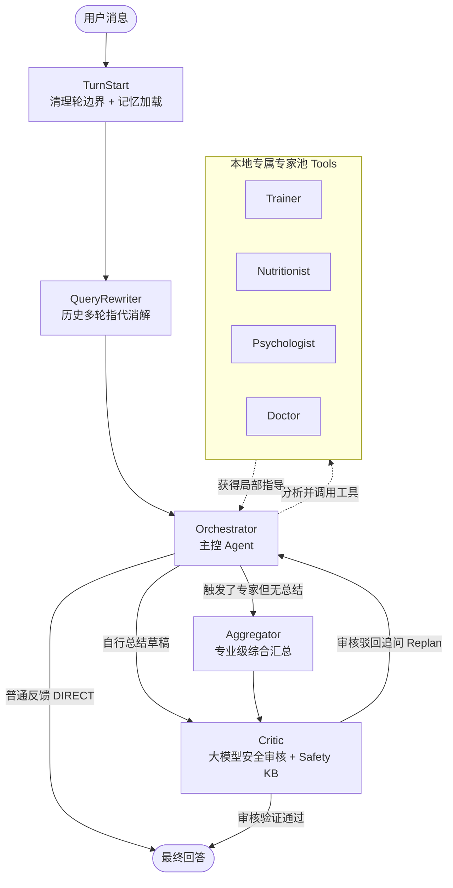

# Health Guide Agent

基于 LangGraph 构建的多 Agent AI 健康管理系统。项目采用了先进的 **父子 Agent + Plan-and-Execute + 动态 Replan + 安全审核** 协作架构，并近期完成了**深度个性化体系**的重构，具备领域隔离、长短期记忆流转、外部工具（MCP）接入以及全链路五层评估能力。

---

## 🌟 核心特性 (Core Features)

### 1. 多 Agent 组织与协作架构

项目底座基于 LangGraph 状态机编排，摒弃了传统链式单向对话，采用了主控调用、动态循环及专门的安全拦截节点层：



- **Orchestrator 主控路由与派发**：处理日常寒暄，当遇到专业需求时，自动作为主 Agent 触发不同领域的专业工具。
- **领域专家网络 (Experts)**：支持多位独立专家（Trainer 训练师、Nutritionist 营养师、Psychologist 心理咨询师、Doctor 医生）；专家相互隔离，获取经过安全裁剪的私有 Prompt，可单独查询外部工具库。
- **聚合与安全熔断 (Aggregator & Critic)**：多专家结果无损综合；无论结果从何而来，输出前必经 **Critic** 结合本地安全红线知识库（Safety KB）对极端低卡、伤病负重、症状就医等高危信息执行拦截或修订。
- **动态闭环反馈 (Replan)**：Critic 节点如果判定当前的响应还遗漏了重要领域或存在隐含风险，可发出 Replan 信号，驳回请求使 Orchestrator 启动二次补员追踪。

### 2. 三维记忆系统与强个性化 (Tri-Layer Memory) 🔥
为了解决“AI 建议空泛通用”的痼疾，系统通过引入 `personalization.py` 与 `episode_memory.py` 实现全链路个性化：
- **语义长期画像 (Semantic Profile)**：跨会话维护用户体征、伤病史和饮食偏好列表。系统会自动将数值型记录“自然语言化”为**「用户卡片」以及严格约束的 Bullet List 列表**，强迫各个 Expert 必须“带入数字、点出伤病限制与对应方案”。
- **Hybrid 情节记忆 (Episodic Memory)**：不再局限于死板的历史摘要，现在包含时间切片（Recency）与 **FAISS 语义向量召回 (Semantic)**（基于用户的 `query` 和 `gist` 内容匹配过往相关的交流片段），精准保障类似于“还记得我前几天说膝盖疼吗”跨线程语义关联。
- **动态历史截断与指代消解**：在有限上下文窗口内自动进行历史压缩，并在 `TurnStart` 阶段使用 `QueryRewriter` 确保多轮复杂会话的代词和隐式语境被有效还原。

### 3. 本地与权威知识扩展 (RAG & MCP)
- **双阶段 RAG**：各领域 Agent 拥用私有隔离版本地知识库，使用 `BAAI/bge-m3` 做 Dense Retrieval 召回候选，配合跨语言重排器 `BAAI/bge-reranker-v2-m3` 执行精确冲顶提取，精准杜绝幻觉。
- **Model Context Protocol (MCP)**无缝集成，默认接入三大官方/社区数据源：
  - **Trainer**：接入 `wger` 开放动作库检索动作详情和肌肉分类。
  - **Nutritionist**：接入 `food-data-central` 查阅 USDA 十万级精准食物热量和微量元素剖析。
  - **Doctor**：接入 `medical-mcp` 查询 FDA 药品相互作用及临床使用指南。

### 4. 工业级五层评测漏斗 (Evaluation Pyramid)
我们避免抛开场景空谈准确率，独创 5 级端到端测试与质量防线，以实现可控的 Agent 系统工程化：
- **L5 - 端到端体验 (End-to-End LLM as Judge)**：通过 61 组混合用例，运用异源 LLM 并设定架构约束（断言 Replan 频率与个性化反馈涵盖率）实施人工化验证。
- **L4 - 架构特性回归 (Architectural Regression)**：14 组基于 Python Mock的架构安全锁验证（并行时序分析、系统下发 Prompt 黑白名单隔离等）。
- **L3 - 安全审核专项 (Safety Critic Test)**：引入混淆矩阵对安全过滤模块实施精准率和漏报率测算。
- **L2 - 冒烟单测 (Smoke Component)**：6 组关键路径的快速执行脚本确保基础可用性。
- **L1 - RAG 精度评测**：506 组生成式问答验证 Embedding（Top-20 漏斗）以及 Re-Rank（首位命中、MRR 评估）表现。

---

## 🛠 环境与安装启动

### 1. 依赖配置
建议使用 Conda 隔离所有 Python 环境。支持一键安装依赖环境：
```bash
conda env create -f environment.yml
conda activate hga
# 如未完全覆盖，可追加:
pip install -r requirements.txt
```

### 2. 模型下载与索引构建
下载 RAG 必要的主从双级向量语言池和重排索引模型。
```bash
python scripts/download_rag_models.py
```
一键拉取初始阶段专家对应的权威语料进行 Embedding 预构建：
```bash
python scripts/download_knowledge_corpus.py
python scripts/build_rag_index.py --rebuild
```

### 3. 配置环境变量
项目根目录复制 `.env` 范例配置文件：
```bash
cp .env.example .env
```
并填写核心大语言模型密钥、基础路径。如果有意体验外扩 MCP 功能，请提前在您的系统全局安装 NodeJS 并执行：
```bash
bash scripts/setup_mcp_servers.sh
```
随后将生成的各个 `MCP_SCRIPT_PATH` 地址以及 API KEY 回填至 `.env`。

### 4. 开始使用
启动主系统 CLI。输入个人名称建立持久化 Profile Thread：
```bash
python main.py
# 或使用调试模式输出完整的决策和工具分配链路
python main.py --detail
```

---

## 📊 开发与评测工具链参考 (Scripts)

在执行系统迭代改版后，所有改动均可通过下方工具核验是否存在退化。

**快速端到端测试（冒烟测试）**：
```bash
python scripts/smoke_error_fallbacks.py       # 兜底测试
python scripts/smoke_personalization.py       # 个性化测试
python scripts/smoke_semantic_episode.py      # 语义召回测试
```

**运行大盘 RAG 质量测试与重排模型交叉分析**：
```bash
python scripts/evaluate_rag.py --dataset eval/rag_eval_dataset_v2.jsonl
python scripts/compare_embedders.py --models BAAI/bge-small-zh-v1.5,BAAI/bge-m3 --dataset eval/rag_eval_dataset_v2.jsonl
```

**触发 L5 级端到端用例与架构安全拦截报告**：
```bash
# 全用例（带 LLM Judge）
python scripts/evaluate_output.py
# 仅断言，0 Token 开销
python scripts/evaluate_output.py --no-judge
# L4 级隔离测试架构执行
python scripts/evaluate_architecture.py
```
