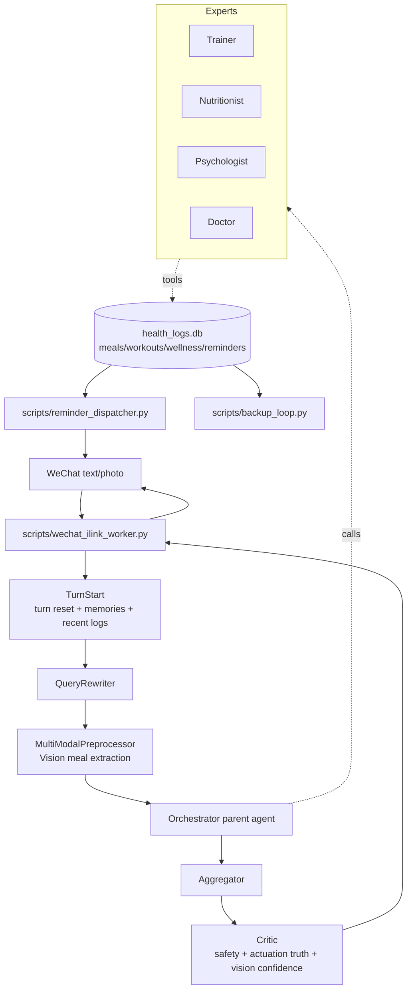

# Health Guide Agent

Health Guide Agent is a LangGraph health-management agent that now runs as a
real WeChat personal bot with multimodal meal grounding, local structured logs,
scheduled reminders, and Docker Compose deployment.

The point of the upgrade is not another text wrapper around an LLM. The agent
can receive a meal photo, estimate nutrition, write real SQLite logs, schedule a
future reminder, read those logs back on the next turn, and keep running on a
cloud server after the developer machine is off.

## Architecture



## What Is New

- `MultiModalPreprocessor` sits between `QueryRewriter` and `Orchestrator`.
  Text-only turns are a no-op; image turns can call a configured Vision model and
  write `vision_extractions.meal` into state.
- `health_guide/integrations/local_logs.py` adds SQLite tables for meals,
  workouts, wellness check-ins, reminders, and worker key-value state. Mutating
  tools use `idempotency_key` and `INSERT OR IGNORE`.
- Experts can now call `log_meal`, `log_workout`, `log_wellness_checkin`,
  `query_logs`, and `push_reminder`.
- Tool results include `[ACTUATION]` JSON. Expert wrappers collect these into
  `state.actuation_log`, and Critic removes unverified “已记录/已设提醒” claims.
- `wechat_ilink_worker.py` long-polls WeChat iLink, downloads images, invokes the
  graph, and replies to the same conversation context.
- `reminder_dispatcher.py` scans due reminders and actively pushes WeChat
  messages.
- `backup_loop.py` backs up SQLite/JSON/report artifacts locally and uploads to
  OSS when credentials are configured.

## Local Setup

```bash
conda env create -f environment.yml
conda activate hga
pip install -r requirements.txt
cp .env.example .env
```

Fill at least:

```env
LLM_BASE_URL=https://api.openai.com/v1
LLM_API_KEY=...
LLM_MODEL=...
```

Optional Vision:

```env
VISION_PROVIDER=openai
VISION_BASE_URL=https://api.openai.com/v1
VISION_API_KEY=...
VISION_MODEL=gpt-4o-mini
```

## Run

CLI remains the safest development entry:

```bash
python main.py --mode cli --detail
```

Initialize local log tables:

```bash
python -c "from health_guide.integrations.local_logs import init_db; init_db()"
```

WeChat mode:

```bash
python scripts/wechat_login.py
python scripts/wechat_ilink_worker.py
python scripts/reminder_dispatcher.py
```

`wechat_ilink.py` keeps endpoint paths configurable because the iLink protocol is
new and may change. Update `.env` endpoint variables if official paths move.

## Docker Deployment

```bash
cp .env.example .env
docker compose up -d --build
docker exec -it hga-worker python scripts/wechat_login.py
docker compose restart worker
docker compose logs -f worker dispatcher backup
```

Persistent data lives in `./data`:

- `checkpoints.db`
- `health_logs.db`
- `observability.db`
- `profile_store.json`
- `episode_store.json`
- `session_store.json`
- `backups/`

See [deploy/README.md](deploy/README.md) and
[deploy/MIGRATION.md](deploy/MIGRATION.md).

## Evaluation

Run fast regression after each wave:

```bash
python scripts/evaluate_output.py --no-judge
```

Full judge run:

```bash
python scripts/evaluate_output.py
```

RAG regression:

```bash
python scripts/evaluate_rag.py --dataset eval/rag_eval_dataset_v2.jsonl
```

Smoke scripts:

```bash
python scripts/smoke_plan_execute.py
python scripts/smoke_dynamic_replan.py
python scripts/smoke_coreference.py
python scripts/smoke_critic_scratchpad.py
```

## Demo Flow

1. Send a meal photo in WeChat with a question like “这餐够支撑增肌吗？晚上提醒我补 25g 蛋白。”
2. Worker downloads the image and passes it to `MultiModalPreprocessor`.
3. Vision writes estimated meal macros into state.
4. Nutritionist logs the meal and schedules a reminder through SQLite tools.
5. Critic verifies `actuation_log` before allowing “已记录/已设提醒” wording.
6. Dispatcher later pushes the reminder proactively through WeChat.
7. The next turn can use `query_logs` or `recent_logs_summary` to review real
   recorded data.
