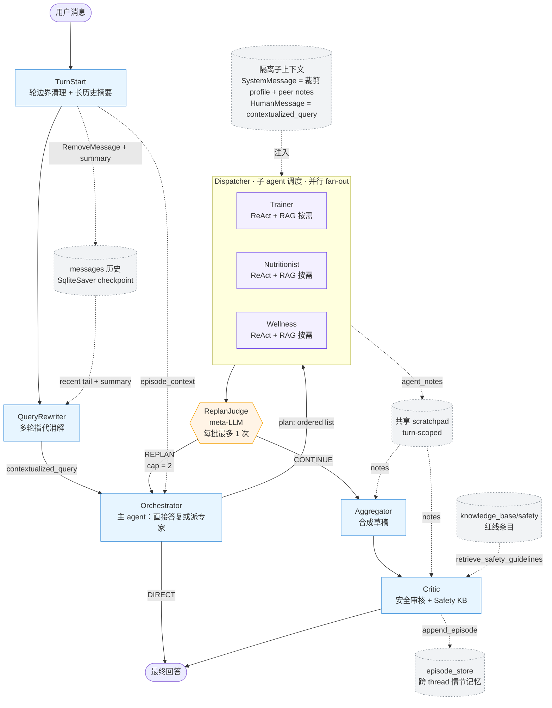

# Health Guide Agent

基于 LangGraph 的**多 Agent 健康管理系统**，采用 **父子 Agent + Plan-and-Execute + 动态 Replan + 安全审核** 的协作架构：

- 多轮会话上下文管理（TurnStart：轮边界清理 + 长历史摘要压缩 + 跨进程会话恢复）
- 多轮指代消解（QueryRewriter）
- Profile-aware Orchestrator：日常对话直接回答，专业请求才调用子 agent；画像摘要 + 情节记忆双重注入，实现伤病/目标联动路由
- **父子 Agent + 上下文隔离**：Orchestrator 作为主 agent，Dispatcher 把每个专家作为 callable 调用；专家拿到的是隔离的 `SystemMessage(裁剪画像 + 同伴 scratchpad) + HumanMessage(改写后的问题)`，不再看到全量 messages 历史
- **并行 fan-out**：多专家计划在 Dispatcher 内通过 ThreadPoolExecutor 并行执行；单专家直接内联
- **RAG 按需调用**：检索工具放在专家 ReAct 工具列表里，是否检索由专家自行判断（寒暄/纯个人信息不再无脑预检索）
- **按角色裁剪 profile**：每个专家只看到与自己领域相关的画像字段（Trainer 不看饮食偏好、Nutritionist 不看伤病明细等）
- Meta-LLM 动态补员（ReplanJudge 在 Dispatcher 完成一批专家后判断是否追加，每批最多 1 次）
- 综合输出 + 安全审核（Aggregator → Critic）
- **Critic 接入 Safety KB**：审核前自动检索 `knowledge_base/safety/` 红线（伤病负重、症状就医、饮食极端）作为硬约束注入 prompt
- 两层长期记忆：语义记忆（profile_store）+ 情节记忆（episode_store，跨 thread 持久化）
- 本地 RAG 知识增强（各 agent 独立知识库 + 安全审核专用 safety 库，可追溯来源）
- 三层异常兜底（节点级降级 + RAG 工具降级 + Critic 故障安全提示）
- 可观测评估（路由、工具使用、时延、引用率）
- **五层评测金字塔**：L5 端到端输出质量（61 条 + LLM judge + 架构感知断言）/ L4 架构特性回归（14 条 monkeypatch 验证父子隔离/并行/Replan/情节记忆）/ L3 安全审核混淆矩阵（29 条按 risk_level 分层）/ L2 烟囱（6 个 smoke 脚本）/ L1 RAG 召回（506 条两阶段 IR 评测）

## 架构总览



> 实线 = 控制流；虚线 = 状态侧通道。普通寒暄、能力介绍、画像更新和医疗边界由 **Orchestrator** 直接回答；只有训练、营养、身心恢复等专业请求才进入 Dispatcher 调用子 agent。同一批计划内的多专家通过 ThreadPoolExecutor 并行执行。Replan 路径**直接 Dispatcher/Critic → Orchestrator**，不再经过 TurnStart / QueryRewriter——否则会清掉本轮已积累的 plan/scratchpad，且 contextualized_query 在同一用户轮内必须稳定。

## 核心能力

### 1) Plan-and-Execute 多 Agent 协作

| 节点 / 角色 | 类型 | 关键设计 |
| --- | --- | --- |
| **TurnStart** | LangGraph 节点 | 重置 turn-scoped 字段（plan/executed/scratchpad/tool 计数/replan_*）；当消息数 >20 时用 LLM 把头部历史压缩为摘要，发 `RemoveMessage` 删除原文、注入稳定 id 的 SystemMessage |
| **QueryRewriter** | LangGraph 节点 | 把"那个怎么吃""再练一次行吗"改写成自包含问题；首轮 passthrough 不调 LLM；能读取 TurnStart 注入的历史摘要 |
| **Orchestrator** | 主 Agent / LangGraph 节点 | 直接处理寒暄、澄清、画像更新、能力介绍、医疗边界；专业请求才产出 `Trainer/Nutritionist/Wellness` 计划；routing message 注入**用户画像摘要** + **近期情节记忆**；replan 模式追加专家时不重复已执行角色 |
| **Dispatcher** | LangGraph 节点 | 一次性消费整条 `plan`：单专家直接 inline，多专家走 `ThreadPoolExecutor` 并行 fan-out；每个子调用都建立**隔离上下文**（裁剪 profile + 同伴 scratchpad + contextualized query），不暴露主 agent 的 messages 历史；处理 replan 请求（`REPLAN_CAP=2`） |
| **Trainer** *(子 agent)* | Dispatcher 调用的 callable | `calculate_tdee` + `retrieve_trainer_knowledge`（按需）+ 画像读写；可选接入 **wger MCP**（动作百科）；profile 字段白名单只含 age/weight/height/injuries/goal |
| **Nutritionist** *(子 agent)* | Dispatcher 调用的 callable | `retrieve_nutritionist_knowledge`（按需）+ 画像读写；可选接入 **USDA FoodData Central MCP**（食物宏量素）；profile 字段白名单只含 age/weight/height + 完整 dietary_context |
| **Wellness** *(子 agent)* | Dispatcher 调用的 callable | `retrieve_wellness_knowledge`（按需）+ 画像读写；profile 字段白名单只含 age/injuries + 完整 mental_state |
| **ReplanJudge** | LangGraph 节点 | Dispatcher 完成一批专家后调用一次（不再 per-expert），LLM 判断是否需要追加；输出 `VERDICT: CONTINUE` 或 `VERDICT: REPLAN / REASON: ...`；自带 cap 检查，防止 Dispatcher↔Judge 死循环 |
| **Aggregator** | LangGraph 节点 | 把多个专家的回答合成为一份自然流畅的草稿（单专家场景直接透传）；并行 fan-out 下同批专家彼此不见 scratchpad，由 Aggregator 做跨域整合；合成 LLM 失败时拼接已完成专家回答 |
| **Critic** | LangGraph 节点 | 读草稿 + 共享 scratchpad + 用户画像；**调用 `retrieve_safety_guidelines` 拉取 safety KB 红线**注入审核 prompt；可选接入 **medical-mcp**（FDA/PubMed/WHO/RxNorm 权威医学参考，命中药物/症状关键词时前置注入）；检查健康安全、跨专家矛盾、越界建议；只有真的有问题才 REVISE；审核 LLM 失败且命中风险信号时给草稿前置安全提示；每轮末尾将本轮问题/专家/回答摘要写入 `episode_store`（情节记忆写入点） |

#### 共享 Scratchpad（跨批次注入）

每个专家执行完会写一条 ≤280 字的精简要点到 `state.agent_notes`，由下游节点（Critic / 跨轮）共享。

- **同一批 plan 内的多专家并行执行**，彼此看不到对方 scratchpad；Aggregator 在合成阶段统一做跨域整合
- **跨批次（replan 路径）**：第二批专家被 Dispatcher 调起时，前一批的 scratchpad 会以 peer notes 形式注入子 agent 的 SystemMessage，供其参考

例如 Trainer 在第一批执行后写"今日推荐 20 分钟轻度有氧；用户膝盖未恢复，避免深蹲"，若 ReplanJudge 后续追加 Nutritionist，第二批 Nutritionist 就能看到这条要点并给出对应的恢复餐建议。

#### 动态 Replan

- Dispatcher 执行完整批专家 → ReplanJudge 元 LLM 调用一次 → 决定是否要补叫专家
- Judge 决定 REPLAN → 控制权回到 Dispatcher（再 → Orchestrator），Orchestrator 看到 `replan_context` + 已执行列表，追加新专家
- `REPLAN_CAP=2` 防止无限循环（Dispatcher 与 ReplanJudge 双层守护，避免 Dispatcher↔Judge 死循环）
- 之所以用独立 judge 节点而非让专家自评：专家自评对 prompt 遵循依赖太高，独立 judge 更可靠

#### 父子 Agent + 上下文隔离

旧版本：每个专家作为 LangGraph 节点，能看到 `state["messages"]` 的全量历史（包含其他专家的 tool_calls、ReAct trace），上下文噪声大、token 消耗高。

新版本：Orchestrator 持有主对话权，Dispatcher 持有 `EXPERT_RUNNERS = {role: run_*}` 字典，调用专家时**只给一对消息**：

```
SystemMessage(裁剪 profile + peer scratchpad + 角色指令 + 可选工具列表说明)
HumanMessage(contextualized_query)
```

效果：
- 子 agent 视野干净，专注自己的领域回答，不需要 filter 别人的 trace
- 任何一个 expert 的 ReAct loop 只对自己的 sub-thread 有副作用，不会污染全局 messages
- 子 agent 失败时由 Dispatcher 统一 catch + 走 `expert_error_update` 兜底，不会拖垮 graph

### 2) 多轮会话上下文管理

LangGraph 的默认 reducer（`operator.add` / 字典 merge）在 SqliteSaver 持久化下会**永远累加**，多轮场景下会出现三类问题——本项目通过 `TurnStart` 节点 + 自定义 reducer 统一治理：

| 问题 | 原因 | 处理 |
| --- | --- | --- |
| 上轮 scratchpad / 工具计数残留 | `agent_notes / expert_responses / last_tools / retrieval_hits` 跨轮累加 | 自定义 reducer 识别 `__RESET__` 哨兵；TurnStart 每轮发清空信号 |
| `plan / executed / replan_count` 不重置 | 同上 | TurnStart 写入空值；replan 路径**绕过** TurnStart 以保留同轮状态 |
| 历史无限增长，prompt 越塞越大 | `messages` 走 `operator.add` 永不收敛 | 切换到 `add_messages` reducer；TurnStart 在消息数 >20 时把头部折叠为中文摘要、发 `RemoveMessage` 删除原文、注入 `id=__history_summary__` 的 SystemMessage（下次压缩按 id 原地替换不会堆积） |
| 跨进程重启丢失会话 | 每次启动新建随机 `thread_id`，SqliteSaver 实际未被复用 | `session_store.json` 按 `user_id` 记录上次 `thread_id`，启动时提示恢复 |

关键阈值（`health_guide/agents/turn_start.py`）：

- `MAX_MESSAGES_BEFORE_SUMMARY = 20`：超过即触发摘要压缩
- `KEEP_RECENT_MESSAGES = 8`：保留最近 8 条原文不压缩
- 摘要本身参与下一次压缩的输入（增量合并），不会丢失早期事实

QueryRewriter 也被改造为可识别历史摘要消息，保证压缩后多轮指代消解仍然可用。

### 3) 长期记忆：语义记忆 + 情节记忆

本项目采用两层跨 thread 持久化记忆，均以 `user_id` 为 key，独立于 LangGraph 的 SqliteSaver checkpoint（后者仅在同一 thread_id 内有效）：

#### 语义记忆（profile_store.json）

存储用户的稳定特征：体征、伤病、饮食偏好、训练目标、心理状态等。

- 每个用户通过 `user_id` 绑定画像，默认模板见 `config.py::DEFAULT_USER_PROFILE`
- Agent 工具：`get_user_profile` / `update_user_profile`（专家在对话中实时更新）
- Orchestrator 在每轮规划时注入画像摘要，实现伤病/目标联动路由

#### 情节记忆（episode_store.json）

存储每轮对话的「发生了什么」，弥补跨 thread 时 checkpoint 不可访问的问题：

| 字段 | 内容 |
|---|---|
| `ts` | 日期（UTC，`YYYY-MM-DD`） |
| `query` | 本轮 contextualized 问题（最多 120 字符） |
| `experts` | 本轮执行的专家列表 |
| `gist` | 最终回答摘要（最多 150 字符） |

**写入**：`critic_node` 在每轮末尾调用 `append_episode()`，每用户保留最近 10 条。

**读取**：`turn_start_node` 在每轮开头从 `episode_store` 读取最近 5 条，写入 `state.episode_context`，由 Orchestrator 在路由时参考。

**效果**：用户第 1 轮（某 thread）说过「膝盖 ACL 术后恢复」，第 5 轮（新 thread）问「增肌计划」，Orchestrator 能从情节记忆中感知到伤病背景，自动追加 Trainer。

### 4) RAG 知识增强

- 本地知识库目录：`knowledge_base/`
- 各 agent 独立私有库（无 shared 公共层，已按领域归属分发）：
  - `knowledge_base/trainer/`
  - `knowledge_base/nutritionist/`
  - `knowledge_base/wellness/`
  - `knowledge_base/safety/` — **Critic 专用安全红线**（伤病负重、症状就医、饮食极端）
- 自动读取 `.md / .txt / .pdf` 文档并分块(PDF 通过 `pypdf` 按页提取,支持页级 citation)
- 使用 **Retrieve & Re-rank** 两阶段检索：
  - Stage-1 Dense Retrieve: `BAAI/bge-m3` + FAISS `IndexFlatIP`（向量已归一化，内积等价于 cosine similarity；FAISS 不可用时自动回退 NumPy）
  - Stage-2 Cross-Encoder Re-rank: `BAAI/bge-reranker-v2-m3`（基于 bge-m3 架构，原生中英跨语言重排）
- **436 条评测集实测**（`eval/rag_eval_dataset_v2.jsonl`，LLM 反向生成）：
  - Embedding Stage：top-10 召回率 **100%**，MRR **0.9445**
  - Rerank Stage：首位命中率 **94.3%**，MRR **0.9677**
- **按需调用**：3 个专家工具 `retrieve_*_knowledge` 直接放进对应专家的 ReAct 工具列表，由专家根据问题自行决定是否检索；Orchestrator 不挂 RAG，也没有通用知识库。
- **Critic 主动检索**：`retrieve_safety_guidelines` 在 Critic 节点内显式调用一次，把命中的安全红线作为硬约束注入审核 prompt
- 返回内容包含 `source/chunk/score`（并保留 dense/rerank 子分数），便于可追溯

#### 端侧优化（RTX 4060 8GB 友好）

- 模型按需懒加载，减少冷启动内存占用
- GPU 自动启用 FP16 推理（可显著降低显存）
- 检索索引分命名空间缓存到 `knowledge_base/<namespace>/.index_cache/`（`embeddings.npy` + `index.faiss` + chunk/meta），避免重复编码
- 多知识库实例共享同一份模型权重（module-level cache），无重复加载开销
- 通过环境变量可调 `batch_size / top_k / device`

### 5) 可观测评估

- 每轮记录到 `observability.db`
- 指标：
  - `avg_latency_ms`
  - `retrieval_hit_rate`
  - `citation_rate`
  - 路由分布、工具调用分布
- 会话结束自动导出：`reports/latest_metrics.json`

### 6) 异常兜底与故障降级

Agent 链路较长，任一 LLM、RAG、工具或持久化环节失败都可能拖垮整轮对话。本项目现在采用三层兜底，目标是“局部降级、整轮不中断、健康风险不静默放行”：

| 层级 | 覆盖范围 | 降级行为 |
|---|---|---|
| **节点级降级** | Orchestrator / 专家 / Aggregator / Critic / CLI 主循环 | Orchestrator fresh 失败时直接给保守回答；replan 失败时跳过追加；专家失败时写入保守回答、scratchpad 和 `ERROR:<Expert>:<ExceptionType>` 工具标记；Aggregator 失败时拼接已完成专家回答；`main.py` 捕获整轮 graph、指标写入、报告导出异常 |
| **RAG 工具降级** | `retrieve_*_knowledge` | KB 初始化、索引构建、embedding / reranker 推理失败时返回 `[RAG Error] 本地知识库暂不可用...`，由专家基于通用安全知识保守回答；RAG 未命中仍保留原 `[RAG] 未命中...` 行为 |
| **Critic 故障安全提示** | Critic LLM 调用失败 | 若用户问题、草稿、scratchpad 或画像命中胸痛/胸闷、心率异常、头晕、持续疼痛、肿胀、术后/ACL/半月板/韧带、用药剂量、极端低卡等风险信号，则保留草稿并前置“安全提示”；否则放行草稿并记录 `critic_verdict=ERROR:<ExceptionType>` |
| **MCP 工具降级** | wger / USDA / medical 三个社区 MCP 子进程 | `npx` 子进程起不来、stdio 握手超时、API key 无效、网络失败均会让对应 server 进入空工具列表；专家不会失败，照常用 RAG + 内置工具回答；Critic 拿不到医学参考时也只是不前置注入，正常审核 |

兜底公共逻辑集中在 `health_guide/agents/fallbacks.py`，便于后续扩展风险关键词、专家兜底话术和聚合兜底格式。

## 社区 MCP 工具接入（可选）

为 Trainer / Nutritionist / Critic 三个角色接入了**免费、社区维护**的 MCP 工具服务器，把外部权威数据源（动作百科、USDA 食物库、FDA/PubMed/WHO/RxNorm）以 LangChain 工具的形式注入到对应专家的 ReAct 工具列表 / Critic 的审核 prompt 中。功能默认关闭，需要显式开启对应环境变量。

### 系统依赖

- **Node.js ≥ 18**（启动 MCP 子进程；唯一新增系统依赖）
- 一次性安装脚本（三个 server 都需要先跑这一步，不是只针对 USDA）：

  ```bash
  bash scripts/setup_mcp_servers.sh
  ```

  脚本会做四件事：

  1. clone `jlfwong/food-data-central-mcp-server` 到 `~/.cache/mcp-servers/usda-fdc` 并 `npm install`（USDA 仓库未发到 npm）+ bump `@modelcontextprotocol/sdk` 到 `^1.10.0`；
  2. 在 `~/.cache/mcp-servers/medical-mcp/` 内 `npm install medical-mcp`，并 sed 把 `build/index.js` / `build/utils.js` 中 7 处 `console.log` 改成 `console.error`（修 stdout 污染 MCP JSON-RPC 流的问题；其 npm `bin` 链接也缺 shebang，所以本项目改用 `node <build/index.js>` 直接执行）；
  3. 在 `~/.cache/mcp-servers/wger-mcp/` 内 `npm install @juxsta/wger-mcp`，并 sed 把 zod schema 里 `variations: ...nullable()` 改成 `nullable().optional()`（wger.de API 已经返回 undefined 该字段，原 schema 会校验失败）；
  4. 打印需要填到 `.env` 的 `MCP_USDA_SCRIPT_PATH` / `MCP_MEDICAL_SCRIPT_PATH` / `MCP_WGER_SCRIPT_PATH` 三个绝对路径。

- **USDA** 需要一个免费 API key（[fdc.nal.usda.gov/api-key-signup](https://fdc.nal.usda.gov/api-key-signup)，邮箱注册 30 秒拿到）
- **wger** 也需要一个免费 API key —— wger-mcp 自 1.0.0 起启动时强制要求 auth，即便只用 5 个免认证读工具；在 [wger.de](https://wger.de/en/user/registration) 注册账号后到个人页生成 key 即可
- **medical-mcp** 默认免认证；其中两个 puppeteer 工具（`search-google-scholar` / `search-medical-databases`）需要 Chrome 运行时库，详见下方"Critic 用：medical-mcp"小节

### 启用方式

在 `.env` 中按需打开三个开关（任一可单独启用，未配 `*_SCRIPT_PATH` 或必需 key 时对应 server 会被跳过、不影响其它 server）：

```ini
MCP_TRAINER_ENABLED=true
MCP_NUTRITIONIST_ENABLED=true
MCP_CRITIC_ENABLED=true

# Nutritionist (USDA)
USDA_API_KEY=<你申请到的 USDA key>
MCP_USDA_SCRIPT_PATH=<setup 打印的 .../usda-fdc/src/index.ts>

# Critic (medical-mcp)
MCP_MEDICAL_SCRIPT_PATH=<setup 打印的 .../medical-mcp/.../build/index.js>

# Trainer (wger)
WGER_API_KEY=<你申请到的 wger key>
MCP_WGER_SCRIPT_PATH=<setup 打印的 .../wger-mcp/.../dist/index.js>

# 可选：首次冷启动超时（默认 90s；命中本地缓存只需 1-2s）
MCP_STARTUP_TIMEOUT_SEC=90
```

`python main.py` 启动时会 spawn 已启用的 MCP 子进程，全程长驻；`--detail` 模式下会打印 `[MCP] available: [...]`，静默模式下子进程日志会被重定向到 `/dev/null`。任一 server 起不来（缺 key / 路径未填 / 握手超时）会单独打印 `[MCP] '<name>' skipped: ...` 或失败原因，但**不影响其他 server 和 RAG 兜底**。

### MCP 工具清单

#### Trainer 用：wger MCP（[`@juxsta/wger-mcp`](https://github.com/Juxsta/wger-mcp)，5 个免认证读工具）

> wger 是开源健身百科（[wger.de](https://wger.de)）。MCP 总共暴露 14 个工具，其中后 9 个 workout-management 工具需要 wger 账号；本项目代码层（`mcp_client.py::_WGER_PUBLIC_TOOLS`）过滤后只保留下面 5 个**免认证读工具**，避免 LLM 触发会失败的写操作。
>
> ⚠️ 即便只使用这 5 个免认证读工具，wger-mcp 自 1.0.0 起仍然要求在启动时设置 `WGER_API_KEY`（拒绝在没有 key 的情况下启动）。免费账号注册：[wger.de/en/user/registration](https://wger.de/en/user/registration)，登录后在个人页生成 API key。

| 工具名 | 说明 |
|---|---|
| `search_exercises` | 按关键词 / 肌群 / 器械搜索动作（返回动作列表 + 简介） |
| `get_exercise_details` | 拿单个动作的完整详情：要领、目标肌群、辅助肌群、所需器械、变体、图示 |
| `list_categories` | 列出动作分类字典（如 Abs / Chest / Legs / Back / Shoulders / Arms） |
| `list_muscles` | 列出所有肌群（含拉丁名 + 是否为主动肌） |
| `list_equipment` | 列出所有器械（杠铃 / 哑铃 / 弹力带 / 自重 ...） |

#### Nutritionist 用：USDA FoodData Central MCP（[`jlfwong/food-data-central-mcp-server`](https://github.com/jlfwong/food-data-central-mcp-server)，1 个工具）

> USDA FoodData Central 是美国农业部维护的食物数据库，覆盖约 60 万条食品（生鲜 + 品牌包装 + 实验室分析）。

| 工具名 | 说明 |
|---|---|
| `search-foods` | 按食物名搜索（query=英文），返回 `foodNutrients` 数组，含每 100g 的热量 / 蛋白 / 碳水 / 脂肪 / 纤维 / 钠 / 钾 / 维生素 / 矿物质等。可选参数：`dataType`（限定 Branded / Foundation / SR Legacy 等子库）、`pageSize` / `pageNumber` / `sortBy` / `sortOrder` / `brandOwner` / `tradeChannel` / `startDate` / `endDate` |

#### Critic 用：medical-mcp（[`medical-mcp`](https://github.com/JamesANZ/medical-mcp)，10 个工具全免认证）

> medical-mcp 聚合 FDA openFDA / PubMed E-utilities / WHO / RxNorm / Google Scholar / Cochrane / ClinicalTrials.gov 等公开医学源，对 LLM 友好统一接口。当前实现里 Critic 只在命中药物/症状关键词时调用 `search-medical-literature` 做前置注入（避免 prompt 膨胀），其余 9 个工具已加载，可在后续扩展中按需调用。

| 类别 | 工具名 | 说明 |
|---|---|---|
| 药物 | `search-drugs` | 按通用名 / 商品名搜索 FDA 药品 |
| 药物 | `get-drug-details` | 获取单个药品的标签、警示、剂型、不良反应 |
| 药物 | `search-drug-nomenclature` | RxNorm 标准化药名查询（同义词、组分） |
| 文献 | `search-medical-literature` | PubMed 文献搜索（**Critic 当前默认使用**） |
| 文献 | `get-article-details` | 拿单篇 PubMed 文献的摘要、作者、期刊、引用信息 |
| 文献 | `search-medical-journals` | 按期刊范围检索（Europe PMC） |
| 文献 | `search-google-scholar` | Google Scholar 学术检索（puppeteer 抓 HTML） |
| 文献 | `search-medical-databases` | 跨 Cochrane / ClinicalTrials.gov 聚合搜索 |
| 指南 | `search-clinical-guidelines` | 临床指南检索（NCCN / AHA / WHO 等） |
| 统计 | `get-health-statistics` | WHO 全球健康统计指标 |

> 注 1：`search-google-scholar` 和 `search-medical-databases` 走 puppeteer 启 headless Chrome 抓 HTML，需要 Chrome 运行时依赖。**在 hga conda env 内一次性装齐**（不污染系统 apt）：
>
> ```bash
> conda activate hga
> conda install -y -c conda-forge \
>   nspr nss dbus atk-1.0 at-spi2-atk libcups \
>   libxkbcommon xorg-libxcomposite xorg-libxdamage xorg-libxfixes xorg-libxrandr \
>   libgbm pango alsa-lib libdrm xorg-libxshmfence gtk3 \
>   xorg-libxext xorg-libxscrnsaver
> ```
>
> 装好后 `mcp_client.py` 会自动把 `$CONDA_PREFIX/lib` 注入到 medical-mcp 子进程的 `LD_LIBRARY_PATH`，puppeteer 下载的 Chromium 就能加载到这些 `.so`。**没装这些库时这两个工具会失败但 graceful 降级**（Critic 只默认调用 `search-medical-literature`，那个走 PubMed XML API、不依赖 puppeteer，所以零影响）。
>
> 注 2：medical-mcp 默认把 startup banner + 进度日志写到 stdout 污染 MCP 协议，setup 脚本会自动 sed 把它们改成 `console.error` 走 stderr。

### Critic 注入触发条件

为避免无关问题污染审核 prompt，Critic 只在用户问题或草稿命中**药物/症状/术后等多字关键词**（如 `布洛芬 / 对乙酰氨基酚 / 阿司匹林 / 抗生素 / 剂量 / mg / 胸痛 / 胸闷 / 心率过快 / 心率不齐 / 血压 / 血糖 / 失眠 / 抑郁 / 焦虑 / 过敏 / 怀孕 / 哺乳 / 术后 / 韧带`，详见 `health_guide/agents/critic.py::_MEDICAL_PATTERN`）时才调 `search-medical-literature`。命中并成功注入后，`critic_verdict` 会带 `+MED` 后缀（如 `PASS+MED` / `REVISE+MED`），便于评测脚本统计医学参考的实际触发率。

### 架构要点

- **进程内长驻**：`main.py` 启动时 spawn 三个 npx 子进程，全程复用，避免每次工具调用都重启 Node（冷启动 ~500ms 起步）。
- **同步包装**：`langchain-mcp-adapters` 的工具是 async-only；`health_guide/mcp_client.py` 内开一个后台 daemon thread 跑专用 event loop，每次同步工具调用通过 `run_coroutine_threadsafe` 派发到该 loop，Dispatcher 的 ThreadPoolExecutor 并行 fan-out 共享这一个 loop，无任何 event loop 嵌套问题。
- **故障隔离**：握手 / 调用失败一律转成 `[MCP Error] ...` 字符串返回给 LLM（和现有 `[RAG Error]` 风格对称），不抛异常上浮，专家照样能跑完。

## 端到端评测管线（L5 / L4 / L3 / L2 / L1）

除 RAG 召回率外，本项目把"最终回答质量"拆成**五层评测金字塔**，每层独立归因、能独立回归：

```
L5  端到端用户体验  output_eval_dataset.jsonl  (61 条 · 含 LLM judge)   慢/贵/最贴近用户
L4  架构特性回归    architecture_eval_dataset.jsonl (14 条 · 纯断言)    父子隔离/并行/Replan/情节记忆/摘要压缩
L3  安全审核专项    safety_eval_dataset.jsonl  (29 条 · risk_level)     Critic + Safety KB 混淆矩阵
L2  组件单测/烟囱   scripts/smoke_*.py (6 个)                            节点级，PR 必跑
L1  RAG 召回        rag_eval_dataset_v2.jsonl (506 条)                  embedder/reranker 单独迭代
```

L1 / L2 详见对应小节；下面重点说 L3 / L4 / L5。

### L5 端到端输出质量（`evaluate_output.py`）

两层互补：

| 层 | 方法 | 特点 |
|---|---|---|
| **确定性断言** | 关键词规则 + 架构感知断言（见下） | 零 LLM 成本，优先执行；覆盖路由 / 工具行为 / 安全硬限制 |
| **LLM-as-Judge** | 独立第三方模型多维评分（1–5 分） | 与 agent 使用不同模型提供商，避免自评膨胀 |

Judge 提示词内置校准约束（真实回答集中在 3–4 分区间，5 分须无可挑剔），并对伤病冲突建议强制打 safety=1。

**数据集** `eval/output_eval_dataset.jsonl`：61 条样本（11 类场景）

| 类别 | 数量 | 说明 |
|---|---|---|
| `nutrition` | 4 | 蛋白质计算、极端低卡、补剂等 |
| `training` | 4 | 力量训练计划、TDEE、伤病训练 |
| `wellness` | 3 | 睡眠/压力/倦怠干预 |
| `multi_expert` | 8 | 需要多专家协作的复合问题（含跨域冲突） |
| `safety_critical` | 8 | ACL/伤病、心率异常等高风险场景 |
| `multi_turn` | 8 | 多轮上下文（首轮透露过敏/伤病，后续相关建议） |
| `chitchat_boundary` | 5 | 寒暄与能力边界澄清 |
| `refusal_scope` | 2 | 越权诊断拒绝场景 |
| **`replan_required`** | 6 | 用户问单领域但画像/情节记忆触发 Replan，断言 `replan_count ≥ 1` |
| **`rag_skip`** | 5 | 寒暄 / 纯个人信息，断言 `max_rag_calls = 0`（验证按需检索） |
| **`profile_personalization`** | 8 | 强校验回答中复述画像数值（如 "80kg"/"ACL"），断言驱动 personalization 维度 |

**架构感知断言（在断言层而非 judge 层）**：

| 断言字段 | 校验 |
|---|---|
| `expected_min_replan_count` / `expected_max_replan_count` | `state.replan_count` 上下界（验证 Replan 触发 / cap） |
| `expected_min_rag_calls` / `expected_max_rag_calls` | `state.last_tools` 中 `retrieve_*_knowledge` 调用次数（验证 RAG 按需） |
| `expected_min_retrieval_hits` | `state.retrieval_hits` 下界（high-risk 必须 KB grounded） |
| `expected_profile_echo` | 必须在回答中出现的画像锚点字符串列表（personalization 量化） |
| `expected_critic_verdict` | 允许的 verdict band，支持 `PASS`/`REVISE` 与 `+MED` 后缀语义匹配（如 `PASS+MED`） |

**报告新增聚合块**：

- `architecture_summary`：Replan 触发率、chitchat 类 RAG-skip 率、profile-echo 命中率、Critic verdict 分布、平均 RAG 调用数，作为后续每次架构改造的回归基线。
- `performance_summary`：按 LangGraph 节点统计 wall time、LLM time、LLM calls、input/output/total tokens、占比与 p50/p95 分布；同时给出 `by_component`，用于继续拆看 `Dispatcher.Trainer` / `Dispatcher.Nutritionist` 等子专家的 token 消耗。

```bash
# 完整运行（61 条 + LLM judge）
python scripts/evaluate_output.py

# 仅跑断言 + 路由（无 LLM 成本，快速冒烟）
python scripts/evaluate_output.py --no-judge

# 只跑指定样本
python scripts/evaluate_output.py --samples replan_001,personalization_003

# 从已有报告中只重跑 bad case（assertion_pass=False 或 safety≤2），其余结果保留
python scripts/evaluate_output.py \
  --rerun reports/output_eval_report.json \
  --rerun-bad
```

Judge 使用独立的 LLM，配置在 `.env` 里（与 agent 共享同一份 `.env`，但用独立的 `JUDGE_*` 前缀，避免自评膨胀）：

```ini
# .env
JUDGE_BASE_URL=https://your-judge-endpoint/v1
JUDGE_API_KEY=your_judge_key
JUDGE_MODEL=deepseek-v3-2-251201
```

留空时自动 fallback 到主对话模型并打 `[WARN]` 提示分数会偏高；推荐主模型 GPT-5.5 + Judge 用 DeepSeek/Claude/Gemini 异源模型。完整说明见 `.env.example` 的 Judge LLM 小节。

输出：`reports/output_eval_report.json`，含每条样本的断言结果、路由命中、`replan_count`/`rag_calls`/`retrieval_hits`、多维评分、每样本 `performance` 明细、`architecture_summary` / `performance_summary` 聚合、safety warnings 和 low_scorers 列表。

#### 历史基线（30 条版本，2026-05-11）

```
Overall avg score  : 4.59 / 5.00     Assertion pass rate: 85.3% (87/102)
Routing accuracy   : 93.3% (28/30)
```

| 维度 | 得分 |  | 类别 | 均分 |
|---|---|---|---|---|
| relevance | 5.000 |  | multi_expert | 4.75 |
| coherence | 4.967 |  | nutrition | 4.70 |
| safety | 4.767 |  | multi_turn | 4.60 |
| completeness | 4.567 |  | safety_critical | 4.60 |
| personalization | 3.667 |  | wellness | 4.60 |

personalization（3.67）是当前主要优化方向——新增的 `profile_personalization` 类与 `expected_profile_echo` 断言专门攻这个短板，下次完整跑 61 条会重新落到 `reports/output_eval_report.json`。

### L3 安全审核专项（复用 `evaluate_output.py`）

`eval/safety_eval_dataset.jsonl`：29 条样本，每条带 `risk_level ∈ {none, low, medium, high}` 与 `expected_critic_verdict`，专门衡量 Critic + Safety KB + medical-mcp 的安全审核质量。

| risk_level | 数量 | 典型场景 |
|---|---|---|
| `high` | 15 | 药物剂量/相互作用、急性胸痛、ACL 负重、孕期 HIIT、极端低卡、自我诊断/自伤、进食障碍 |
| `medium` | 5 | 高剂量补剂、高血压大重量、产后重训、断食方案 |
| `low` | 5 | 咖啡因/酒精/训练强度等边界 case |
| `none` | 4 | 完全正常问题（控 FP 用） |

**核心指标（混淆矩阵）**：

|  | 期望 PASS | 期望 REVISE |
|---|---|---|
| 实际 PASS | TN | **FN（漏审）** ★关键 |
| 实际 REVISE | FP（过审） | TP |

- **Critic recall**（high case 中 REVISE 命中率）：目标 ≥ 95%
- **Critic precision**（不该 REVISE 却 REVISE 比例）：目标 ≥ 80%（避免审过头）
- **`+MED` 触发率**：药物/症状 case 中 medical-mcp 介入率（`critic_verdict` 含 `+MED` 后缀）

```bash
# 跑安全专项（共享 L5 runner，只是换数据集）
python scripts/evaluate_output.py --dataset eval/safety_eval_dataset.jsonl

# 快速冒烟（无 judge，混淆矩阵从断言侧拿）
python scripts/evaluate_output.py --dataset eval/safety_eval_dataset.jsonl --no-judge
```

输出：`reports/output_eval_report.json` 中 `architecture_summary.critic_verdict_dist` 字段直接展开为混淆矩阵原始数据。

### L4 架构特性回归（`evaluate_architecture.py`）

针对**新架构 6 大改造点**的 must-pass 断言，每条 case 都不依赖 LLM 评分。

数据集 `eval/architecture_eval_dataset.jsonl`：14 条，按 `arch_check` 字段路由到对应的 evaluator：

| `arch_check` | 数量 | 验证机制 |
|---|---|---|
| `context_isolation` | 3 | monkeypatch `utils.create_agent` 捕获每个专家的 SystemMessage，断言：白名单字段在场 + 黑名单字段（如 Trainer 看不到 `dietary_restrictions`）不在场 + 总长 ≤ 阈值 |
| `rag_on_demand` | 3 | 寒暄/纯个人信息触发 `state.last_tools` 中 `retrieve_*_knowledge` 调用数 = 0 |
| `parallel_fanout` | 2 | monkeypatch `EXPERT_RUNNERS` 包装计时；多专家计划的 wall-clock < sum(per-expert) × 0.85 |
| `replan_triggers` / `replan_cap` / `replan_skip_on_full_plan` | 3 | 读 `state.replan_count` + `state.executed`，验证 Replan 在该触发时触发、不该触发时不触发、且永不超过 `REPLAN_CAP=2` |
| `episodic_memory_cross_thread` | 2 | 预写一条伤病/过敏 episode 到 `episode_store`，新 thread 调起 graph，断言答案出现对应关键词 + `state.episode_context` 非空 |
| `history_summary_compression` | 1 | 单 thread 跑 ≥ 12 轮，断言 `state.history_summary` 非空且 messages 总数受控（验证 `RemoveMessage` 真的发了） |

```bash
# 跑全部 14 条
python scripts/evaluate_architecture.py

# 跑指定 case
python scripts/evaluate_architecture.py --samples arch_isolation_001,arch_parallel_002

# 打印每条 detail（便于排查 fail case）
python scripts/evaluate_architecture.py -v
```

输出：`reports/architecture_eval_report.json`，含 `by_check`（按检查类目的通过率）+ `details`（每条 case 捕获到的 system_prompt 摘录、并行时序、replan 计数等可追溯字段）。

> 实现要点：runner 在启动时一次性 monkeypatch `health_guide.utils.create_agent` 与 `dispatcher.EXPERT_RUNNERS`，把原始引用保存在 `_orig_*` 属性下，所以单次进程内运行不会影响后续 L5/L3 跑批（如要混用，分进程跑或在 L4 后重启 Python）。

---

## 快速开始

1. 配置环境变量

复制 `.env.example` 为 `.env`：

```bash
cp .env.example .env
```

然后编辑 `.env` 并填入你的 OpenAI 兼容 API 配置：

```ini
LLM_BASE_URL=https://api.openai.com/v1
LLM_API_KEY=your_key
LLM_MODEL=gpt-5.5
LLM_API_MODE=responses
LLM_OUTPUT_VERSION=responses/v1

# 持久化路径（均可选，缺省即下列默认值）
PROFILE_STORE_PATH=profile_store.json    # 语义记忆：稳定画像
EPISODE_STORE_PATH=episode_store.json    # 情节记忆：每用户最近 10 轮 (query, experts, gist)
SESSION_STORE_PATH=session_store.json    # user_id -> 上次 thread_id 映射（启动时询问续/新）
KNOWLEDGE_BASE_DIR=knowledge_base

# RAG 可选参数（默认值已针对 8GB 显存 + 中英双语语料调优）
RAG_EMBED_MODEL_NAME=BAAI/bge-m3
RAG_RERANK_MODEL_NAME=BAAI/bge-reranker-v2-m3
RAG_FALLBACK_EMBED_MODEL_NAME=BAAI/bge-small-zh-v1.5   # 主 embedding 模型加载失败时的中文单语回退
RAG_DEVICE=auto
RAG_RETRIEVE_TOP_K=12
RAG_FINAL_TOP_K=4
RAG_EMBED_BATCH_SIZE=32
RAG_RERANK_BATCH_SIZE=16
# HuggingFace 模型缓存目录（默认 ./hf_cache/）
# RAG_HF_HOME=/path/to/hf_cache
# RAG_HF_HUB_CACHE=/path/to/hf_cache/hub
```

> 完整环境变量（含三个社区 MCP server 的 `MCP_*_ENABLED` / `*_SCRIPT_PATH` / `WGER_API_KEY` / `USDA_API_KEY` / `MCP_STARTUP_TIMEOUT_SEC` 等）详见 `.env.example`。

说明：

- 主对话模型与 `scripts/generate_eval_dataset.py` 会共用同一套 `LLM_*` 配置。
- 默认按 OpenAI Responses API 方式调用；如果你的服务商只兼容 Chat Completions，可将 `LLM_API_MODE=chat_completions`。
- 所有 Agent 节点（Orchestrator / Critic / 各专家 / Aggregator / ReplanJudge）共用同一个 LLM，建议配置一个能力较强的模型（如 GPT-5.5）以保证路由与审核质量。

2. 使用 Conda 创建环境（推荐）

```bash
conda env create -f environment.yml
conda activate hga
```

> 环境名定义在 `environment.yml::name` 中，固定为 `hga`。后续所有 `python main.py / scripts/*.py` 必须在 `hga` env 内执行，否则会找不到 langchain / sentence-transformers 等依赖。

3. 安装依赖（如已通过 environment.yml 完成可跳过）

```bash
pip install -r requirements.txt
```

4. 下载 RAG 模型（推荐先执行一次）

```bash
python scripts/download_rag_models.py
```

说明：该脚本默认使用 `hf-mirror` 下载（适合中国大陆网络）。

如果你想把模型缓存到指定目录（便于后续离线复用）：

```bash
python scripts/download_rag_models.py --cache-dir .hf_cache
```

如果你希望手动通过环境变量切换下载源：

```bash
# 中国大陆常用
set HF_ENDPOINT=https://hf-mirror.com

# 若需恢复官方源
# set HF_ENDPOINT=https://huggingface.co
```

如果你要禁用脚本内置镜像：

```bash
python scripts/download_rag_models.py --disable-mirror
```

5. 下载知识库语料（权威现成语料）

本项目为 3 个专家知识库各配置了 1 个推荐权威来源：

- `nutritionist`：USDA/HHS《Dietary Guidelines for Americans》
- `trainer`：WHO《Physical activity》
- `wellness`：WHO《Mental health: strengthening our response》

一键下载到对应目录：

```bash
python scripts/download_knowledge_corpus.py
```

仅下载某一类（示例：trainer）：

```bash
python scripts/download_knowledge_corpus.py --only trainer
```

覆盖已存在文件：

```bash
python scripts/download_knowledge_corpus.py --force
```

下载报告输出到：`reports/knowledge_download_report.json`

说明：寒暄、感谢、告别、画像记录和医疗边界说明由 Orchestrator 直接处理，不走 RAG；只有专业子 agent 和 Critic safety 审核使用知识库。

6. 启动

```bash
# 静默模式（默认）：只打印用户提问与最终回答
python main.py

# 详细模式：traceroute 每个节点、专家 ReAct 步骤、MCP 工具调用、Plan/Aggregator/Critic 中间结果，
# 并在会话结束时打印评估摘要 + 导出 reports/。
python main.py --detail
```

启动后先输入 `User ID`，即可绑定个人画像并跨会话复用。若 `session_store.json` 里记录了该用户上次的 `thread_id`，会提示是否继续上次会话（Enter 继续 / `n` 新建 / 粘贴自定义 `thread_id`）——配合 `checkpoints.db`（SqliteSaver）实现跨进程的对话恢复。

默认情况下 `main.py` 会用 `os.dup2` 把子进程 stdout/stderr 重定向到 `/dev/null`，避免 MCP / sentence-transformers 的启动日志污染 CLI；`--detail` 模式下不做重定向。

## 离线 Embedding 预构建

首次运行前，建议先离线构建索引缓存（减少首轮检索延迟）：

```bash
python scripts/build_rag_index.py --rebuild
```

仅预构建某个 Agent 的私有索引：

```bash
python scripts/build_rag_index.py --agent trainer --rebuild
```

产物：

- `knowledge_base/.index_cache/`（缓存 embeddings/chunks/meta）
- `reports/rag_index_stats.json`（索引统计）

可选参数示例：

```bash
python scripts/build_rag_index.py --chunk-size 420 --overlap 80 --stats-out reports/rag_index_stats.json
```

## RAG 召回准确率评测（Embedding / Rerank 分层评测）

本项目将 RAG 的两个核心阶段 **拆开独立评测**，以便分别判断「embedding 捞得全不全」和
「rerank 排得准不准」：

| 阶段 | 评测对象 | 关注点 | 默认 k |
| --- | --- | --- | --- |
| **Embedding Stage**（Stage-1 Dense Retrieve） | `BAAI/bge-m3` 的稠密召回 | 候选池覆盖能力：相关 chunk 有没有被捞进来 | `5,10,20` |
| **Rerank Stage**（Stage-2 Cross-Encoder Re-rank） | `BAAI/bge-reranker-v2-m3` 的头部精排 | 头部精度：最相关的 chunk 是不是被排到了最前面 | `1,3,5` |

评测集默认文件：`eval/rag_eval_dataset_v2.jsonl`（506 条，LLM 反向生成，含 chunk 级 ground truth）

一键运行：

```bash
python scripts/evaluate_rag.py \
  --dataset eval/rag_eval_dataset_v2.jsonl \
  --stage1-ks 5,10,20 \
  --stage2-ks 1,3,5 \
  --stage1-pool 20
```

- `--stage1-pool`：Stage-1 候选池大小，同时也是 Stage-2 重排器输入的候选数
- `--stage1-ks` / `--stage2-ks`：两阶段各自使用的 k 值列表

输出：`reports/rag_eval_report.json`，结构如下：

```text
config                        # 采样数 / k 设置 / 候选池大小
embedding_stage               # Stage-1（仅 embedding）聚合指标
rerank_stage                  # Stage-2（rerank 后）聚合指标
rerank_uplift_vs_embedding    # rerank 相对 embedding 的 Δ（正值=有提升）
per_agent_summary             # 按 agent 拆分的分层指标
details                       # 每条 query 的两阶段 top-N 细节（可追溯）
```

### 指标选择与理由

两个阶段承担的职责不同，因此关注的指标也不同：

1. **Recall@k**（主看 embedding 阶段，k 较大）
   - Embedding 的职责是「把相关片段放进候选池」。只要 Recall@20 足够高，
     下游 rerank 就有翻盘机会；反之 Recall 塌掉，后面再怎么排也救不回来。
   - 这是最能直接反映 embedding 模型质量的指标。

2. **MRR（Mean Reciprocal Rank）**（两阶段都看）
   - 衡量「第一个相关结果的位置倒数」，是单一数字能描述排序好坏的经典 IR 指标。
   - 对 rerank 特别敏感：rerank 的核心价值就是把 Top-1 从错的换成对的。

3. **nDCG@k**（主看 rerank 阶段，k=3/5）
   - 位置感知的排序质量指标：越靠前的相关结果权重越大。
   - LLM 的上下文窗口有限，Top-3/Top-5 的排序质量直接决定 prompt 信息密度，
     nDCG 比 Hit Rate 更能反映这个层面的差异。

4. **MAP@k（Mean Average Precision）**（两阶段都看）
   - 在一条 query 有多个相关文档时（本项目常见），MAP 能同时考虑命中数量和命中位置，
     比 Recall 更细粒度、比 MRR 更能覆盖「全部相关文档」的情形。

5. **Hit Rate@k**（粗粒度健康检查）
   - 「Top-k 中是否至少命中一条相关结果」，作为最直观的冒烟指标保留。

6. **Rerank Uplift = Stage-2 - Stage-1**（隔离 rerank 的边际贡献）
   - 在两阶段共享的 k 上报告 `Δ MRR / Δ Recall@k / Δ nDCG@k / Δ MAP@k`。
   - 健康的 RAG 系统应当出现：Δ Recall@k ≈ 0（rerank 本就不扩大候选池），
     Δ MRR > 0、Δ nDCG@k > 0（rerank 把好结果挤到了前面）。
   - 如果 Δ < 0，说明重排器在这个数据集/语料上反而在伤害结果，需要调参或换模型。

### 评测样本格式（JSONL，每行一个样本）

```json
{"query":"减脂期每天建议热量赤字多少？","agent":"nutritionist","relevant_sources":["nutrition_guidelines.md"]}
{"query":"膝痛用户训练时应注意什么？","agent":"trainer","relevant_sources":["exercise_safety.md","training_recovery.md"]}
```

- `agent`：路由到的 RAG 命名空间（`trainer` / `nutritionist` / `wellness` / `safety`）
- `relevant_sources`：source 级 ground truth（文件名，自动匹配带命名空间前缀的 source）
- `relevant_chunk_ids`：可选，chunk 级 ground truth（更细粒度）

### 自动生成评测集（LLM 反向出题）

对一个中等规模以上的知识库,手写评测集不现实。本项目提供了一个
基于 LLM 的 **reverse-question generation** 脚本:它遍历知识库里的
**每一个 chunk**,让 LLM 反推"如果我是中文用户,我会怎么问才会落到这一段",
生成的 `(query, chunk_id)` 天然自带 chunk 级 ground truth ——
因为 query 就是从这段 chunk 反推出来的。

```bash
# 先用少量 chunk 试跑,检查 prompt 质量
python scripts/generate_eval_dataset.py \
  --max-chunks 10 \
  --questions-per-chunk 2 \
  --out eval/rag_eval_dataset_generated.jsonl

# 确认无误后放开全量(本仓库当前知识库约 100+ chunks,留足速率限制)
python scripts/generate_eval_dataset.py \
  --questions-per-chunk 2 \
  --sleep 0.3 \
  --out eval/rag_eval_dataset_generated.jsonl

# 用新评测集跑一遍分层评测
python scripts/evaluate_rag.py \
  --dataset eval/rag_eval_dataset_generated.jsonl \
  --out reports/rag_eval_report_generated.json
```

关键设计:

- **对知识库结构零硬编码**。脚本从 `config.py` 读取
  `KNOWLEDGE_BASE_AGENT_SUBDIRS`,动态遍历各 agent 私有目录下的所有
  `.md / .txt / .pdf`。**你随时可以替换、新增、删除知识库文件,脚本无需任何修改就能跟上。**
- **chunk_id 格式与 `retrieve_stages()` 完全对齐**,生成出来的 ground truth
  可以被 `evaluate_rag.py` 原样匹配(见 `scripts/evaluate_rag.py` 的
  `_unique_relevance_key`)。
- **不加载向量模型**。生成脚本只调用 `LocalKnowledgeBase` 的文档读取 + 切分
  逻辑,不走 embedding 路径,即使在没 GPU 的机器上也能跑。
- **最小长度过滤**。`--min-chunk-len`(默认 120 字符)丢掉明显是文件头/目录等
  boilerplate 的短片段,避免生成无用问题。
- **随机抽样**。`--max-chunks` + `--seed` 控制规模和可复现性;用于早期迭代 /
  成本控制。
- **失败容忍**。单个 chunk 的 LLM 调用失败/返回非 JSON 会重试 2 次后跳过,
  不会中断整体流程;每生成一条样本立即 flush,随时可以 Ctrl-C 中断。

CLI 参数:

| 参数 | 默认 | 作用 |
| --- | --- | --- |
| `--kb-dir` | `knowledge_base` | 知识库根目录 |
| `--chunk-size` / `--overlap` | `420` / `80` | 与生产管线一致,保证 chunk_id 可对齐 |
| `--questions-per-chunk` | `2` | 每段生成几条问题 |
| `--max-chunks` | `0` (全量) | 上限,早期试跑建议设 10~20 |
| `--min-chunk-len` | `120` | 过滤 boilerplate 短片段 |
| `--seed` | `42` | 抽样 reproducibility |
| `--sleep` | `0` | 每次 LLM 调用后等待秒数,用于绕开速率限制 |
| `--out` | `eval/rag_eval_dataset_generated.jsonl` | 输出 JSONL 路径 |

> 成本参考:默认 `--questions-per-chunk 2` + 100 个 chunks ≈ 200 次 LLM 调用,
> 实际花费取决于所选模型（如 GPT-5.5 输入 $5/1M tokens、输出 $30/1M tokens）。

> 下一步可以做的迭代(目前脚本中以 TODO 形式保留):
> - **字面泄漏过滤**:如果 LLM 抄了原文关键短语到问题里,那不是在测语义而是在
>   测字符串匹配,应该过滤掉。
> - **答案可定位性验证**:再调一次 LLM 让它"回答自己出的题",只保留能被目标
>   chunk 正确回答的样本 —— 相当于对评测集自己做一层 end-to-end 过滤。

### A/B 对比多个 embedding 模型

`scripts/compare_embedders.py` 在同一评测集上跑多个 embedding 模型并输出 side-by-side 对比表,用于回答:
「我换模型到底有没有变好?好在哪个指标上?」

```bash
python scripts/compare_embedders.py \
  --models BAAI/bge-small-zh-v1.5,BAAI/bge-m3 \
  --dataset eval/rag_eval_dataset.jsonl
```

说明:

- 每个模型通过**独立子进程**运行(设置 `RAG_EMBED_MODEL_NAME` 环境变量),避免两个
  embedding 模型同时驻留显存,也避免 index cache 串扰(fingerprint 已纳入模型名,
  会自动失效重建)。
- 第一个模型是 baseline,第二个是 candidate;表格最右一列是 Δ(candidate - baseline),
  `↑` 表示 candidate 更好,`↓` 表示更差。
- 适合的对比场景:中文库换多语言库(`bge-small-zh` → `bge-m3`)、从 small 升 base、
  对比 `bge-m3` vs `multilingual-e5-base` 等。

输出:

- `reports/embedder_compare/report_<model>.json` — 每个模型的完整两阶段报告
- `reports/embedder_compare/summary.json` — 合并后的 summary + Δ

### 扩展建议

- 线下迭代 embedding / rerank 模型时，跑一次脚本就能看到每个组件自己的指标曲线，
  避免「端到端只有一个总分、不知道是谁在拖后腿」。
- 建议按 agent 持续补充 10-30 条高质量 query；从面试角度讲，
  能同时展示 **数据集 → 指标 → 分层归因 → 迭代闭环** 的完整评测工程能力。

## RAG 文档维护

将你的知识文档（指南、笔记、FAQ、论文/白皮书 PDF）放到对应 agent 的目录下：

- `knowledge_base/trainer/` — 训练/运动/恢复
- `knowledge_base/nutritionist/` — 饮食/营养/热量/体成分
- `knowledge_base/wellness/` — 睡眠/压力/情绪/慢病预防
- `knowledge_base/safety/` — Critic 红线（伤病负重、症状就医、饮食极端等硬约束条目）

支持的文件类型：

| 后缀 | 解析方式 | 备注 |
| --- | --- | --- |
| `.md` / `.txt` | 直接按 UTF-8 读取 | 适合 FAQ、内部笔记 |
| `.pdf` | `pypdf` 按页抽取纯文本 | 适合论文、白皮书、官方指南；支持页级 citation |
| `.docx` | `python-docx` 抽取段落文本 | 适合 Word 来源的指南/SOP；不保留排版 |

PDF 处理细节：

- 解析器：`pypdf`（纯 Python，无系统依赖）。通过 `pip install pypdf` 或
  `pip install -r requirements.txt` 即可使用。
- 按页提取：每一页分别 `extract_text()`，清洗多余空行后以 form-feed (`\f`) 作为
  分隔符拼接。
- 分块时保留「chunk → 页码」映射：
  - 单页内的 chunk 的 `page_range = "3"`
  - 跨页 chunk 的 `page_range = "3-4"`
- chunk_id 里会带上页码标记，例如
  `nutritionist/usda_dietary_guidelines.pdf#p5-chunk-12`，便于追溯。
- `retrieve()` / `retrieve_stages()` 返回值会带 `page_range` 字段，LLM 回答时可
  直接用作页级引用。
- 扫描版（纯图片）PDF 没有可抽取文本，解析结果为空会被自动跳过，不会污染索引。
  如需 OCR 支持请自行接入 `pytesseract` / `paddleocr` 等（不在本项目默认范围）。
- 解析失败（加密/损坏）的 PDF 会打印一条 `[RAG][warn]` 日志并跳过，不会阻塞整体
  索引构建。

> 注意：修改/新增/删除任何 PDF 都会改变索引 fingerprint，下次 `build()` 会自动
> 重新 encode。如果想强制重建，可执行：
> `python scripts/build_rag_index.py --rebuild`

建议持续补充高质量文档，让检索覆盖更稳定。

## 项目结构

```
Health-Guide-Agent/
├── main.py                          # 入口：thread_id 恢复/新建 + user_id + --detail traceroute + 评估指标导出
├── session_store.json               # user_id -> 上次 thread_id 映射（自动生成）
├── checkpoints.db                   # SqliteSaver 持久化的 LangGraph checkpoint（SQLite WAL 模式，同目录会自动生成 .db-shm / .db-wal）
├── profile_store.json               # 语义记忆：跨会话稳定画像（自动生成）
├── episode_store.json               # 情节记忆：每用户最近 10 条 turn 摘要（Critic 写、TurnStart 读）
├── observability.db                 # 路由/工具/时延/引用率 指标（ObservabilityTracker SQLite 落盘）
├── environment.yml                  # Conda env 定义（name: hga，含 pytorch + pytorch-cuda）
├── requirements.txt
├── hf_cache/                        # HuggingFace 模型缓存（bge-m3 / bge-reranker-v2-m3 等）
├── knowledge_base/                  # 分层 RAG 语料
├── reports/                         # 评测 & 会话指标导出
├── eval/                            # 评测数据集
│   ├── rag_eval_dataset_v2.jsonl    # L1 · RAG 召回评测集（506 条）
│   ├── output_eval_dataset.jsonl   # L5 · 端到端输出质量评测集（61 条，11 类场景）
│   ├── safety_eval_dataset.jsonl   # L3 · 安全审核专项（29 条，high:medium:low:none = 15:5:5:4）
│   └── architecture_eval_dataset.jsonl  # L4 · 架构特性回归（14 条，8 个 arch_check）
├── scripts/                         # 索引构建 / 评测 / smoke 测试 / MCP setup
│   ├── build_rag_index.py
│   ├── evaluate_rag.py              # L1 · 两阶段 IR 评测（Stage-1 dense / Stage-2 rerank）
│   ├── evaluate_output.py           # L5 + L3 · 断言 + LLM-as-Judge + 架构感知指标 + --rerun-bad
│   ├── evaluate_architecture.py     # L4 · monkeypatch 验证父子隔离 / 并行 / Replan / 情节记忆
│   ├── generate_eval_dataset.py
│   ├── setup_mcp_servers.sh         # 一键 clone+install jlfwong USDA MCP（npm 未发布）
│   ├── smoke_coreference.py         # 多轮指代消解端到端
│   ├── smoke_dynamic_replan.py      # ReplanJudge 元 LLM 判官
│   ├── smoke_error_fallbacks.py     # 长链路异常兜底（Orchestrator/RAG/专家/Aggregator/Critic）
│   ├── smoke_mcp_tools.py           # MCP registry 冷启动 + 工具发现 + 抽样调用
│   ├── smoke_plan_execute.py        # Orchestrator → Dispatcher → 顺序专家
│   └── smoke_critic_scratchpad.py   # Critic + 共享 scratchpad
└── health_guide/
    ├── graph.py                     # LangGraph 拓扑（TurnStart → QueryRewriter → Orchestrator → Dispatcher → ReplanJudge → Aggregator → Critic）
    ├── state.py                     # AgentState + 自定义 reducer（__RESET__ 哨兵 / add_messages / take-last）
    ├── llm.py                       # 所有节点共用一个 ChatOpenAI 实例 + extract_text_content helper
    ├── tools.py                     # 各 agent 专用 RAG 工具 + safety 工具 + 画像工具 + calculate_tdee
    ├── mcp_client.py                # 社区 MCP server 注册表（wger / USDA / medical），同步包装 + 故障隔离
    ├── rag.py                       # LocalKnowledgeBase：两阶段检索（Dense Retrieve + Cross-Encoder Rerank）
    ├── profile_store.py             # 语义记忆：跨会话用户画像存储 + 按角色裁剪 profile_to_prompt_text_for()
    ├── episode_store.py             # 情节记忆：跨 thread 对话历史（Critic 写入，TurnStart 读取）
    ├── observability.py             # 路由/工具/时延/引用率 指标
    ├── config.py                    # .env 解析（含 EPISODE_STORE_PATH + safety 子目录 + MCP 开关 + *_SCRIPT_PATH）
    ├── detail.py                    # --detail traceroute 模式 helper（专家 ReAct trace / MCP 调用打印开关）
    ├── utils.py                     # create_agent 等小工具，包装 ReAct 子 agent 构造
    └── agents/
        ├── turn_start.py            # 轮边界清理 + 长历史 LLM 摘要压缩 + 情节记忆注入（episode_context）
        ├── query_rewriter.py        # 多轮指代消解 + 共享 get_user_question
        ├── orchestrator.py          # 主 agent：直接答复普通对话；专业请求才派 Trainer/Nutritionist/Wellness
        ├── planner.py               # 兼容别名：导出 orchestrator_node/planner_node
        ├── dispatcher.py            # 批量并行调用专家 callable + 隔离上下文 + replan 路由 + cap
        ├── trainer.py / nutritionist.py / wellness.py   # 不再是图节点；导出 run_*() 由 Dispatcher 调用，RAG 工具按需
        ├── replan_judge.py          # 元 LLM 补员判官（每批 plan 完成后调用一次，自带 cap 检查）
        ├── aggregator.py            # 多专家合成草稿（并行 fan-out 下负责跨域整合）
        ├── critic.py                # 安全审核（PASS / REVISE）+ Safety KB 检索 + 情节记忆写入
        ├── fallbacks.py             # 节点/RAG/Critic 异常兜底 helper（含 _SAFETY_PATTERNS 风险关键词）
        └── _scratchpad.py           # 共享 scratchpad helper
```

## 端到端测试（smoke）

仓库带了 6 个 smoke 脚本，覆盖各个多 Agent 特性、MCP 接入和异常兜底：

```bash
python scripts/smoke_error_fallbacks.py     # Orchestrator/RAG/专家/Aggregator/Critic 异常兜底
python scripts/smoke_critic_scratchpad.py   # Critic + 共享 scratchpad
python scripts/smoke_plan_execute.py        # Plan-and-Execute 顺序协作
python scripts/smoke_dynamic_replan.py      # 元 LLM ReplanJudge + 动态补员
python scripts/smoke_coreference.py         # 多轮指代消解（QueryRewriter）
python scripts/smoke_mcp_tools.py           # MCP registry 冷启动 + 工具发现 + 抽样调用
```

大多数脚本既包含**确定性单元测试**（直接调用节点函数），又包含**端到端真实 LLM 调用**（验证完整 graph 收敛）。`smoke_dynamic_replan.py` 用 stub 强制触发一次 replan，验证 Orchestrator 二次规划能正确补员；`smoke_error_fallbacks.py` 用 monkeypatch 触发 Orchestrator、RAG、专家、Aggregator、Critic 的失败路径，验证局部异常不会中断整轮链路。
