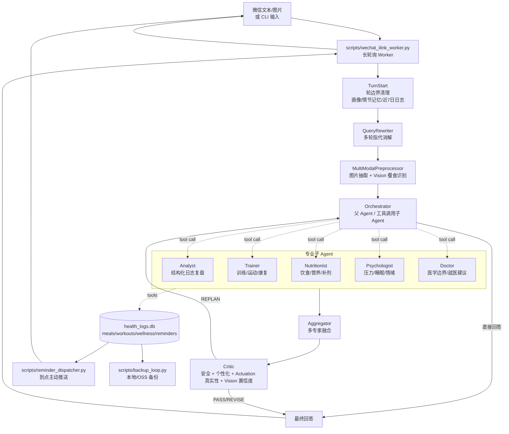

# Health Guide Agent

一个面向个人健康管理的 LangGraph 多 Agent 系统。它不只是把用户问题转发给 LLM，而是把“多专家协作、长期记忆、RAG 证据检索、多模态餐食识别、结构化健康日志、主动提醒、微信个人号入口、Docker 常驻部署”串成了一个可以真实使用的健康助手。

项目当前支持：

- 在 CLI 或微信入口接收用户文本 / 图片问题。
- 通过 `TurnStart -> QueryRewriter -> MultiModalPreprocessor -> Orchestrator -> Aggregator -> Critic` 的 LangGraph 流水线完成一轮健康咨询。
- 由父 Agent 通过工具调用子 Agent：`Analyst`、`Trainer`、`Nutritionist`、`Psychologist`、`Doctor`。
- 使用本地 SQLite 记录餐食、训练、睡眠/情绪、提醒，并在下一轮回灌近 7 日日志摘要。
- 对餐盘图片做 Vision 抽取，估算食物、热量、蛋白质、碳水、脂肪和置信度。
- 通过 WeChat iLink / ClawBot 风格接口长轮询收消息、下载图片、回复用户、主动推提醒。
- 用 Docker Compose 启动 `worker`、`dispatcher`、`backup` 三个常驻服务。

> 面试一句话版本：这是一个有真实 side effect 的健康管理 Agent。它能在微信里看餐盘照、估算营养、写入本地健康日志、设置提醒、下一轮读取历史数据继续分析，并通过 Critic 审核防止“没做却说做了”的虚假 actuation。

## 目录

- [项目定位](#项目定位)
- [核心架构](#核心架构)
- [技术亮点](#技术亮点)
- [关键模块](#关键模块)
- [状态设计与记忆系统](#状态设计与记忆系统)
- [RAG 检索系统](#rag-检索系统)
- [多模态与真实世界 Actuation](#多模态与真实世界-actuation)
- [评测结果](#评测结果)
- [本地运行](#本地运行)
- [Docker 部署](#docker-部署)
- [面试讲解速记](#面试讲解速记)

## 项目定位

Health Guide Agent 解决的是个人健康建议里常见的三个问题：

1. **通用回答太多，缺少个体差异。**
   系统维护用户画像，包括年龄、身高、体重、伤病、饮食偏好、压力源、回答风格，并要求专家和 Aggregator 把画像转成具体推导，例如按体重计算蛋白质区间、按 ACL/半月板状态调整动作边界。

2. **LLM 只会说，不会做。**
   专家可以调用 `log_meal`、`log_workout`、`log_wellness_checkin`、`push_reminder` 等工具，把建议落到 SQLite 里。工具返回 `[ACTUATION]` JSON 流水，Critic 会检查流水后才允许最终回答声称“已记录 / 已设置提醒”。

3. **一次性问答无法形成健康管理闭环。**
   `TurnStart` 每轮读取近 7 日健康日志摘要，并加载情节记忆；`Analyst` 可读取 7-30 日结构化日志做复盘。用户下一轮问“我这周吃得怎么样”，系统能基于真实记录给出趋势，而不是凭空编。

## 核心架构



### 当前 LangGraph 拓扑

入口定义在 `health_guide/graph.py`：

1. `TurnStart`
   - 清空本轮临时状态，避免上轮 scratchpad、工具日志、replan 状态污染新一轮。
   - 加载 `personalization_ctx`、`episode_context`、`recent_logs_summary`。
   - 长历史超过阈值后做中文摘要压缩，并用 `RemoveMessage` 删除旧消息。

2. `QueryRewriter`
   - 解决多轮指代，例如“那我明天怎么吃”会被改写成独立问题。

3. `MultiModalPreprocessor`
   - 文本轮 no-op。
   - 图片轮提取 image part；如果像餐食问题，则调用 Vision，写入 `vision_extractions.meal`。

4. `Orchestrator`
   - 父 Agent，直接面向用户。
   - 可直接回答寒暄、画像记录、医疗边界说明。
   - 对复杂问题通过工具调用子 Agent，而不是输出一个静态 route label。

5. `Aggregator`
   - 多专家结果融合为统一口吻草稿。
   - 保留画像数值、伤病约束、Doctor disclaimer 和 actuation 约束。

6. `Critic`
   - 审核草稿；可以 PASS、REVISE 或 REPLAN。
   - REPLAN 会回到 Orchestrator 再补叫一个缺失专家，受 `REPLAN_CAP = 2` 限制。

## 技术亮点

### 1. 父 Agent 调子 Agent，而不是传统硬路由

早期多 Agent 常见做法是 Planner 输出专家列表，再由 Dispatcher 按列表执行。现在的实现把 Orchestrator 升级成真正的父 Agent：

- 子 Agent 被封装成 LangChain tools：`consult_analyst`、`consult_trainer`、`consult_nutritionist`、`consult_psychologist`、`consult_doctor`。
- Orchestrator 可以根据对话上下文连续调用多个专家，也可以在简单问题上直接回答。
- 对医疗边界、心理危机、身体不适、提醒意图、日志复盘等高风险/高确定性场景，代码里有 deterministic guard，减少纯 LLM 路由漂移。
- 保留 `planner_node = orchestrator_node` 兼容旧脚本。

这个设计的面试价值：可以讲清楚“不是把专家名字当分类标签，而是父 Agent 在 tool-use loop 里做任务分解和执行”。

### 2. 子 Agent 输入隔离 + scratchpad 汇总

子 Agent 不直接看到父 Agent 的完整消息历史，也不互相读取原始工具 trace。Orchestrator 给每个子 Agent 构造裁剪后的输入：

- 用户问题：优先使用 `contextualized_query`。
- 用户画像：来自本轮统一的 `personalization_ctx`。
- 情节记忆：来自 `episode_context`。
- 同轮信息：来自 `vision_extractions`、`recent_logs_summary`。
- 同伴摘要：通过 `format_peer_notes` 传递 scratchpad，而不是传完整对话。

这样可以降低 token 成本，减少工具调用噪声污染，并让 Aggregator/Critic 拿到结构化的跨专家要点。

### 3. Turn-scoped reducer 防止跨轮状态污染

`health_guide/state.py` 定义了三类 reducer：

- `_turn_dict`：支持 `{ "__RESET__": true }` 清空本轮 dict。
- `_turn_list`：支持 list 首项 `RESET_SENTINEL` 清空本轮 list。
- `_turn_int`：支持 `("__RESET__", 0)` 重置计数器。

`TurnStart` 每轮显式 reset：

- `agent_notes`
- `expert_responses`
- `last_tools`
- `image_inputs`
- `vision_extractions`
- `actuation_log`
- `retrieval_hits`
- `plan / executed / next / replan_count`
- `draft_answer / critic_verdict / replan_context`

这是 LangGraph 持久化会话里很容易踩坑的地方：如果只用 list append 或 dict merge，上一轮专家输出会残留到下一轮，导致 Critic、Aggregator 误判。

### 4. 画像驱动的个性化决策点

项目不是简单把 profile 粘到 prompt，而是生成“必须落地”的 personalization decision points：

- 年龄 / 身高 / 体重：用于 TDEE、心率区间、蛋白质 g/kg、热量缺口等数值推导。
- 伤病 / 术后：用于动作禁忌、替代动作、进阶条件、就医边界。
- 饮食偏好 / 过敏 / 乳糖不耐：用于食材替换和补剂建议。
- 压力源 / 睡眠问题：用于压力管理、睡前流程和情绪支持。

Aggregator 和 Critic 都会读取这些决策点，检查回答是否只是“复述画像”，还是确实把画像转成了方案差异。

### 5. Actuation 真实性校验

所有真实 side effect 工具都遵循同一种返回格式：

```text
[ACTUATION]{"ok":true,"action":"log_meal","table":"meals","row_id":1,...}
餐食日志已记录。
```

专家 wrapper 会把工具消息中的 `[ACTUATION]` JSON 提取到 `state.actuation_log`。Aggregator 和 Critic 的规则是：

- 如果 `actuation_log` 里没有 `ok=true` 的对应流水，最终回答不能说“已记录 / 已保存 / 已设提醒 / 已安排”。
- 如果草稿里出现未证实的 actuation claim，Critic 会 deterministic rewrite，把“已记录”降级成“建议记录 / 可以帮你记录”。

这点是项目区别于普通聊天机器人的核心：Agent 的语言承诺必须和真实工具执行结果一致。

### 6. Vision 置信度进入安全审核

`MultiModalPreprocessor` 调用 `integrations/vision.py` 后写入：

```json
{
  "meal": {
    "items": [{"name": "...", "estimated_amount": "..."}],
    "kcal": 720,
    "protein_g": 52,
    "carbs_g": 85,
    "fat_g": 18,
    "confidence": 0.78,
    "notes": "图片营养素为估算值。"
  }
}
```

Critic 中有 Vision 规则：

- `confidence < 0.5` 时，不能用确定语气输出精确热量或宏量营养素。
- 如果草稿已经给了精确数字，会补充“图片识别置信度偏低，只能当作粗估范围”。

### 7. 本地 SQLite 闭环

`health_guide/integrations/local_logs.py` 维护四类健康数据：

- `meals`：餐食、热量、蛋白、碳水、脂肪、来源。
- `workouts`：训练计划、训练状态。
- `wellness`：睡眠、情绪、恢复 check-in。
- `reminders`：待推送提醒。

设计细节：

- 所有 mutating tool 都接受 `idempotency_key`。
- 表上有 `UNIQUE(idempotency_key)`，写入使用 `INSERT OR IGNORE`。
- SQLite 开启 `WAL` 和 `busy_timeout=5000`，适配 worker / dispatcher 同时访问。
- `summarize_recent_logs` 每轮生成近 7 日摘要，供 Planner/Orchestrator/专家使用。

这样可以抵抗 LangGraph checkpoint replay、worker retry、网络重试造成的重复 side effect。

### 8. 部署不是 demo 脚本，而是常驻服务

Docker Compose 提供三个服务：

- `worker`：运行 `scripts/wechat_ilink_worker.py`，负责长轮询微信、下载图片、调用 graph、回复消息。
- `dispatcher`：运行 `scripts/reminder_dispatcher.py`，扫描到点 reminders 并主动推送微信。
- `backup`：运行 `scripts/backup_loop.py`，备份 SQLite、JSON、reports 等数据，可选上传 OSS。

数据通过 volume 持久化到 `./data`：

- `checkpoints.db`
- `health_logs.db`
- `observability.db`
- `profile_store.json`
- `episode_store.json`
- `session_store.json`
- `backups/`

## 关键模块

| 路径 | 作用 |
|---|---|
| `health_guide/graph.py` | LangGraph 拓扑、checkpoint、条件边。 |
| `health_guide/state.py` | AgentState 与 turn-scoped reducer。 |
| `health_guide/agents/turn_start.py` | 轮边界清理、长历史摘要、画像/情节记忆/日志摘要加载。 |
| `health_guide/agents/query_rewriter.py` | 多轮问题改写。 |
| `health_guide/agents/multimodal_preprocessor.py` | 图片输入解析与餐食 Vision grounding。 |
| `health_guide/agents/orchestrator.py` | 父 Agent、确定性安全 guard、子 Agent 工具封装。 |
| `health_guide/agents/analyst.py` | 读取健康日志，输出趋势与复盘。 |
| `health_guide/agents/trainer.py` | 训练、动作、运动恢复、TDEE/BMR、比赛训练。 |
| `health_guide/agents/nutritionist.py` | 饮食、营养、热量、蛋白质、补剂、食谱。 |
| `health_guide/agents/psychologist.py` | 压力、睡眠、情绪、动力、心理安全边界。 |
| `health_guide/agents/doctor.py` | 医学资料、症状风险、就医建议、用药边界。 |
| `health_guide/agents/aggregator.py` | 多专家回答融合。 |
| `health_guide/agents/critic.py` | 最终审核、REVISE、REPLAN、Actuation/Vision 规则。 |
| `health_guide/tools.py` | RAG 工具、画像工具、健康日志工具统一出口。 |
| `health_guide/rag.py` | 本地知识库、chunk、embedding、FAISS、rerank、缓存。 |
| `health_guide/integrations/local_logs.py` | SQLite 健康日志与提醒表。 |
| `health_guide/integrations/vision.py` | OpenAI-compatible Vision helper。 |
| `health_guide/integrations/wechat_ilink.py` | 微信 iLink/ClawBot 风格 HTTP client。 |
| `scripts/evaluate_output.py` | 端到端输出评测、断言、路由、Judge、性能 profiling。 |
| `scripts/evaluate_rag.py` | RAG 两阶段检索评测。 |
| `docker-compose.yml` | worker / dispatcher / backup 常驻部署。 |

## 状态设计与记忆系统

### AgentState 关键字段

| 字段 | 生命周期 | 说明 |
|---|---|---|
| `messages` | checkpoint 持久 | LangGraph 消息历史，支持 `RemoveMessage` 摘要压缩。 |
| `contextualized_query` | 每轮覆盖 | QueryRewriter 输出的独立问题。 |
| `personalization_ctx` | 每轮覆盖 | 本轮统一用户画像快照。 |
| `episode_context` | 每轮覆盖 | 最近/语义相关对话摘要。 |
| `recent_logs_summary` | 每轮覆盖 | 近 7 日 SQLite 健康日志摘要。 |
| `image_inputs` | turn-scoped | 本轮图片列表。 |
| `vision_extractions` | turn-scoped | 本轮 Vision 抽取结果。 |
| `expert_responses` | turn-scoped | 子 Agent 回答。 |
| `agent_notes` | turn-scoped | 子 Agent scratchpad 要点。 |
| `actuation_log` | turn-scoped | 本轮真实 side effect 流水。 |
| `draft_answer` | 每轮覆盖 | Aggregator 或 Orchestrator 交给 Critic 的草稿。 |
| `critic_verdict` | 每轮覆盖 | PASS / REVISE / REPLAN / 规则命中原因。 |

### 三层记忆

1. **Profile memory**：`profile_store.json`
   - 结构化用户画像。
   - 通过 `set_physical_stats`、`add_injury`、`set_dietary_goal` 等工具更新。

2. **Episode memory**：`episode_store.json`
   - 每轮对话的 query、experts、gist、facts。
   - 支持最近 N 轮召回和语义相似召回。

3. **Checkpoint memory**：`checkpoints.db`
   - LangGraph SqliteSaver 保存 thread 状态。
   - 支持跨进程恢复和长会话继续。

额外的结构化健康日志在 `health_logs.db` 中维护，不混入 profile，以免“长期画像”和“每日行为数据”语义混乱。

## RAG 检索系统

项目使用本地知识库，不依赖云端向量数据库。每个专家有独立 namespace：

- `knowledge_base/trainer`
- `knowledge_base/nutritionist`
- `knowledge_base/psychologist`
- `knowledge_base/doctor`
- `knowledge_base/safety`

### 两阶段检索

`health_guide/rag.py` 的 `LocalKnowledgeBase` 实现：

1. **文档读取**
   - 支持 `.md`、`.txt`、`.pdf`、`.docx`。
   - PDF 用 `pypdf` 按页抽取，使用 form-feed 标记页边界。
   - docx 提取段落和表格单元格。

2. **Chunking**
   - 默认 `chunk_size=420`，`overlap=100`。
   - 用中文/英文句末标点做软边界对齐，减少句子中间硬切。
   - 保留 source、chunk_id、PDF page_range。

3. **Stage 1 Dense Retrieval**
   - 默认 embedding：`BAAI/bge-m3`。
   - 默认 Top-K：`RAG_RETRIEVE_TOP_K=12`。
   - 支持 `faiss-cpu`，不可用时可降级。

4. **Stage 2 Cross-Encoder Rerank**
   - 默认 reranker：`BAAI/bge-reranker-v2-m3`。
   - 默认最终返回：`RAG_FINAL_TOP_K=4`。

5. **索引缓存**
   - 每个知识库目录下维护 `.index_cache`。
   - 缓存 embedding、FAISS index、chunks/meta 和 fingerprint。
   - fingerprint 绑定文档内容、chunk 参数、实际 embedding 模型，避免错误复用旧索引。

### RAG 当前索引规模

来自 `reports/rag_index_stats.json`：

| Namespace | 文档数 | Chunk 数 | 缓存 | FAISS |
|---|---:|---:|---:|---:|
| trainer | 8 | 108 | yes | yes |
| nutritionist | 11 | 161 | yes | yes |
| psychologist | 10 | 122 | yes | yes |
| doctor | 6 | 36 | yes | yes |
| safety | 3 | 16 | yes | yes |

### RAG 小样本评测

来自 `reports/rag_eval_report_small.json`，20 条样本：

| 阶段 | MRR | Recall | Hit Rate |
|---|---:|---:|---:|
| Embedding Stage | 0.7655 | R@5 0.875 / R@10 0.975 / R@20 1.000 | H@5 0.900 / H@10 1.000 / H@20 1.000 |
| Rerank Stage | 0.8250 | R@1 0.550 / R@3 0.825 / R@5 0.925 | H@1 0.700 / H@3 0.900 / H@5 1.000 |

计划文档中还记录过历史大集基线：506 条 RAG 召回测试，MRR 0.9677，首位命中 94.3%。当前仓库保留了 `eval/rag_eval_dataset_v2.jsonl` 用于持续回归。

## 多模态与真实世界 Actuation

### 图片输入格式

`MultiModalPreprocessor` 支持三种图片来源：

- `image_url`
- `media_id`
- `image_bytes_b64`

微信 worker 会把用户图片下载为 bytes，再转成 `image_bytes_b64` 放入 HumanMessage content list。文本轮完全不调用 Vision，避免无意义成本。

### Vision Provider

`integrations/vision.py` 使用 OpenAI-compatible `/chat/completions` 形式，因此可接：

- OpenAI
- 通义 / 智谱等兼容网关
- 自建兼容代理

未配置 Vision 时不会抛错，而是返回低置信度空结果，保证 CLI 和纯文本评测可继续运行。

### Health Logs Schema

`migrations/001_create_health_logs.sql` 和 `local_logs.py` 对应表结构：

- `meals(id, user_id, date_iso, items_json, kcal, protein_g, carbs_g, fat_g, source, idempotency_key, created_at)`
- `workouts(id, user_id, date_iso, plan_json, status, idempotency_key, created_at)`
- `wellness(id, user_id, date_iso, sleep_h, mood, notes, idempotency_key, created_at)`
- `reminders(id, user_id, target_wxid, context_token, remind_at_iso, remind_at_epoch, text, delivered, idempotency_key, created_at)`
- `kv(key, value, updated_at)`：用于 worker offset 等轻量状态。

## 评测结果

### 最新端到端 no-judge 回归

命令：

```bash
python scripts/evaluate_output.py --no-judge
```

报告：`reports/output_eval_report.json`，run_id `2026-05-19_221043`。

| 指标 | 结果 |
|---|---:|
| 样本数 | 53 |
| 确定性断言 | 273 / 273 |
| 断言通过率 | 100% |
| 路由命中 | 53 / 53 |
| 路由命中率 | 100% |
| Critic verdict | PASS 49 / REVISE 4 |
| Chitchat RAG skip | 100% |
| Profile echo pass | 100% |
| Personalization quantification | 100% |
| 平均 RAG calls | 0.06 |
| 平均 retrieval hits | 0.02 |
| 平均 wall time | 9.90s / sample |
| 平均 tokens | 3734 / sample |
| 平均 LLM calls | 1.66 / sample |

这个版本是完成 Agenticity / Docker 升级后的最终快速回归，重点验证路由、断言、个性化落地和安全规则没有被新节点破坏。

### 历史 LLM-as-Judge 基线

报告摘要：`reports/output_eval_analysis_2026-05-19.md`，run_id `2026-05-19_001751`。

| 指标 | 结果 |
|---|---:|
| 总样本 | 61 |
| Judge 成功样本 | 60 |
| Overall avg | 4.573 / 5.000 |
| Relevance | 5.000 |
| Completeness | 4.400 |
| Safety | 4.817 |
| Personalization | 3.650 |
| Coherence | 5.000 |
| 确定性断言 | 301 / 314 |
| 断言通过率 | 95.9% |
| 路由命中 | 55 / 60 |
| 路由命中率 | 91.7% |

这个历史基线暴露了当时最大的短板：个性化只有 3.650，原因是“提到了画像，但没有把画像转成推导”。后续升级重点正是把画像锚点变成可检查的 decision points，并在 Critic 中验证落地。

### 架构专项评测

- `reports/architecture_eval_report.json`：`rag_on_demand` 1/1，通过率 100%。
- `reports/architecture_eval_round12_isolation_final.json`：`context_isolation` 2/2，通过率 100%。

### Smoke Tests

常用烟测：

```bash
python scripts/smoke_plan_execute.py
python scripts/smoke_dynamic_replan.py
python scripts/smoke_coreference.py
python scripts/smoke_critic_scratchpad.py
```

Docker 验证命令：

```bash
docker compose build
docker compose run --rm --no-deps worker python -c "from health_guide.integrations.local_logs import init_db; init_db(); print('container ok')"
docker compose run --rm --no-deps worker python -c "from health_guide.graph import graph; print('graph ok')"
```

已验证：

- `docker compose config --quiet` 通过。
- `worker / dispatcher / backup` 三个镜像成功构建。
- 容器内 `init_db` 输出 `container ok`。
- 容器内 `graph` 导入输出 `graph ok`。

## 本地运行

### 1. 安装依赖

```bash
conda env create -f environment.yml
conda activate hga
pip install -r requirements.txt
cp .env.example .env
```

至少填写：

```env
LLM_BASE_URL=https://api.openai.com/v1
LLM_API_KEY=...
LLM_MODEL=...
```

可选 Vision：

```env
VISION_ENABLED=true
VISION_PROVIDER=openai
VISION_BASE_URL=https://api.openai.com/v1
VISION_API_KEY=...
VISION_MODEL=gpt-4o-mini
```

可选微信：

```env
WECHAT_BOT_TOKEN=...
WECHAT_ILINK_BASE_URL=https://ilinkai.weixin.qq.com
WECHAT_ENDPOINT_UPDATES=/v1/messages/updates
WECHAT_ENDPOINT_SEND=/v1/messages/send
WECHAT_ENDPOINT_PUSH=/v1/messages/push
```

### 2. 初始化本地数据库

```bash
python -c "from health_guide.integrations.local_logs import init_db; init_db()"
```

### 3. CLI 调试

```bash
python main.py --mode cli --detail
```

`--detail` 会打印专家执行 trace，适合面试演示“哪些专家被调用、哪些工具被用到、Critic 如何判定”。

### 4. 微信入口

```bash
python scripts/wechat_login.py
python scripts/wechat_ilink_worker.py
python scripts/reminder_dispatcher.py
```

说明：

- `wechat_login.py` 用于首次扫码/绑定 token。
- `wechat_ilink_worker.py` 长轮询消息并调用 LangGraph。
- `reminder_dispatcher.py` 扫描 SQLite reminders，到点主动推送。

## Docker 部署

### 构建与启动

```bash
cp .env.example .env
docker compose up -d --build
docker compose logs -f worker dispatcher backup
```

首次登录微信：

```bash
docker exec -it hga-worker python scripts/wechat_login.py
docker compose restart worker
```

### Compose 服务

| 服务 | 命令 | 作用 |
|---|---|---|
| `worker` | `python scripts/wechat_ilink_worker.py` | 接收微信消息、调用 graph、回复用户。 |
| `dispatcher` | `python scripts/reminder_dispatcher.py` | 扫描 reminders，到点主动推送。 |
| `backup` | `python scripts/backup_loop.py` | 定时备份 SQLite/JSON/reports，可选 OSS。 |

### 数据目录

Compose 会挂载：

```text
./data:/app/data
./data/.hf_cache:/root/.cache/huggingface
./knowledge_base:/app/knowledge_base
./logs:/app/logs
./reports:/app/reports
```

注意：RAG/HuggingFace 缓存需要持久化，否则容器重启后可能重新下载或重建模型缓存。

更多部署说明：

- `deploy/README.md`
- `deploy/MIGRATION.md`

## 面试讲解速记

### 我会怎么介绍这个项目

这是一个健康管理方向的多 Agent 系统。我没有停留在“多专家聊天”层面，而是做了四个工程化闭环：

1. **认知闭环**：Orchestrator 调 Trainer/Nutritionist/Psychologist/Doctor/Analyst，Aggregator 融合，Critic 审核。
2. **记忆闭环**：profile memory、episode memory、LangGraph checkpoint、health logs 四层持久化。
3. **数据闭环**：餐食、训练、睡眠、提醒写入 SQLite；下一轮 TurnStart 回灌近 7 日摘要，Analyst 可读取明细复盘。
4. **产品闭环**：微信入口 + 主动提醒 + Docker 常驻部署，本机关机后仍能接消息和推送。

### 面试官问“为什么不用 ChatGPT？”

可以回答：

ChatGPT 能回答健康建议，但它不会天然拥有我的长期健康数据，也不能保证真实执行提醒和记录。这个项目的关键不是“回答更像医生”，而是把 LLM 放进一个受控执行系统里：

- 工具写 SQLite，有幂等 key。
- 工具返回 actuation log。
- Critic 检查 actuation log，防止虚假承诺。
- 下一轮读取真实日志继续分析。
- 微信 worker 和 dispatcher 让它能主动触达用户。

### 面试官问“多 Agent 的必要性是什么？”

可以回答：

健康问题天然跨域。例如用户问“我这餐够不够支撑今晚腿训，晚上提醒我补蛋白”，里面至少包含：

- 餐食营养估算：Nutritionist。
- 训练负荷与恢复：Trainer。
- 历史数据复盘：Analyst。
- 真实提醒写入：push_reminder。
- 最终安全审查：Critic。

单 Agent 也能写一段话，但很难把路由、工具权限、领域提示词、RAG namespace、输出审核拆清楚。多 Agent 的价值在于隔离职责和降低复杂度，而不是为了数量好看。

### 面试官问“最难的 bug 是什么？”

可以讲两个：

1. **LangGraph reducer 状态残留。**
   旧轮次的 `agent_notes`、`expert_responses`、`actuation_log` 如果不清，会污染新一轮 Aggregator/Critic。解决方式是在 `state.py` 做支持 reset sentinel 的 reducer，并在 `TurnStart` 统一清理 turn-scoped 字段。

2. **Actuation 语言和真实工具结果不一致。**
   LLM 很容易说“已帮你记录”，但工具可能失败或根本没被调用。解决方式是所有 side effect 工具返回 `[ACTUATION]` JSON，专家 wrapper 提取到 state，Critic 根据 `ok=true` 流水决定是否允许这类表述。

### 面试官问“怎么证明系统没退化？”

可以拿评测数字说：

- 最新 no-judge 回归：53 条样本，273/273 断言通过，53/53 路由命中。
- 历史 Judge 基线：overall 4.573/5，safety 4.817，relevance/coherence 都是 5.0。
- RAG 小样本：rerank 后 MRR 0.825，Hit@5 1.0。
- 架构专项：RAG on-demand 和 context isolation 都是 100%。

### 面试官问“下一步怎么优化？”

可以回答：

- 把 Docker 镜像里的 PyTorch 依赖切到 CPU wheel，当前镜像约 9GB，部署成本偏高。
- 增加更多多模态评测样本，尤其是低置信度餐食图、混合餐、包装食品。
- 对 reminder/WeChat 做更严格的端到端 mock 测试，覆盖重试、重复消息、offset 恢复。
- 把 Analyst 的趋势分析从简单均值升级为目标达成率、缺口天数、移动平均和异常检测。
- 把 Critic 的 P2/P3 规则继续结构化，减少纯 prompt 判断。

## 常用命令

```bash
# CLI
python main.py --mode cli --detail

# 初始化健康日志数据库
python -c "from health_guide.integrations.local_logs import init_db; init_db()"

# 端到端快速回归
python scripts/evaluate_output.py --no-judge

# 完整 Judge 评测
python scripts/evaluate_output.py

# RAG 评测
python scripts/evaluate_rag.py --dataset eval/rag_eval_dataset_v2.jsonl

# Docker 构建与验证
docker compose build
docker compose run --rm --no-deps worker python -c "from health_guide.graph import graph; print('graph ok')"
```

## 医疗安全说明

本项目是健康管理与信息整理助手，不是医疗器械，也不替代医生诊断、处方或急救服务。涉及胸痛胸闷、呼吸困难、晕厥、持续疼痛、神经症状、药物剂量、处方、疾病诊断等问题时，系统会优先给出就医或医生评估建议。
