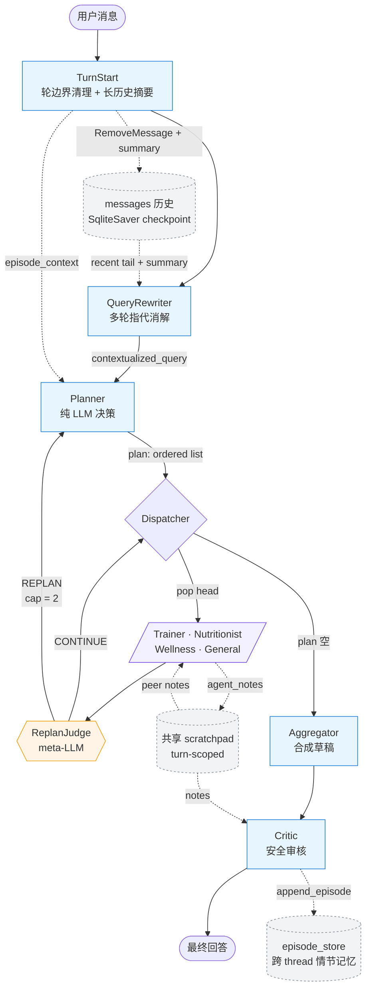

# Health Guide Agent

基于 LangGraph 的**多 Agent 健康管理系统**，采用 **Plan-and-Execute + 动态 Replan + 安全审核** 的协作架构：

- 多轮会话上下文管理（TurnStart：轮边界清理 + 长历史摘要压缩 + 跨进程会话恢复）
- 多轮指代消解（QueryRewriter）
- Profile-aware Planner：画像摘要 + 情节记忆双重注入，实现伤病/目标联动路由
- 顺序执行 + 共享 scratchpad（专家之间能看到彼此要点）
- Meta-LLM 动态补员（ReplanJudge 决定是否追加专家）
- 综合输出 + 安全审核（Aggregator → Critic）
- 两层长期记忆：语义记忆（profile_store）+ 情节记忆（episode_store，跨 thread 持久化）
- 本地 RAG 知识增强（各 agent 独立知识库，可追溯来源）
- 可观测评估（路由、工具使用、时延、引用率）

## 架构总览



> 实线 = 控制流；虚线 = 状态侧通道。Replan 路径**直接 Dispatcher → Planner**，不再经过 TurnStart / QueryRewriter——否则会清掉本轮已积累的 plan/scratchpad，且 contextualized_query 在同一用户轮内必须稳定。

## 核心能力

### 1) Plan-and-Execute 多 Agent 协作

| 节点 | 角色 | 关键设计 |
| --- | --- | --- |
| **TurnStart** | 轮边界清理 + 上下文压缩 | 重置 turn-scoped 字段（plan/executed/scratchpad/tool 计数/replan_*）；当消息数 >20 时用 LLM 把头部历史压缩为摘要，发 `RemoveMessage` 删除原文、注入稳定 id 的 SystemMessage |
| **QueryRewriter** | 多轮指代消解 | 把"那个怎么吃""再练一次行吗"改写成自包含问题；首轮 passthrough 不调 LLM；能读取 TurnStart 注入的历史摘要 |
| **Planner** | 任务规划 | 纯 LLM 决策（无关键词硬编码）；routing message 注入**用户画像摘要**（伤病/目标）+ **近期情节记忆**（最近 5 条跨 thread 历史），实现伤病联动路由；按 Trainer→Nutritionist→Wellness→General 推荐顺序排序；replan 模式追加专家时不重复已执行角色 |
| **Dispatcher** | 顺序执行 | 从 `plan` 头部出列，appending 到 `executed`；处理 replan 请求（带 `REPLAN_CAP=2` 限制防止无限循环） |
| **Trainer** | 力量训练教练 | `calculate_tdee` + `retrieve_trainer_knowledge` + 画像读写 |
| **Nutritionist** | 膳食营养师 | `retrieve_nutritionist_knowledge` + 画像读写 |
| **Wellness** | 身心康复师 | `retrieve_wellness_knowledge` + 画像读写 |
| **General** | 通用助理 | 寒暄、澄清、`retrieve_general_knowledge` |
| **ReplanJudge** | 元 LLM 补员判官 | 每个专家执行完后，独立调用 LLM 判断是否需要追加其他专家；输出 `VERDICT: CONTINUE` 或 `VERDICT: REPLAN / REASON: ...` |
| **Aggregator** | 综合输出 | 把多个专家的回答合成为一份自然流畅的草稿（单专家场景直接透传） |
| **Critic** | 安全审核 | 读草稿 + 共享 scratchpad + 用户画像，检查健康安全、跨专家矛盾、越界建议；只有真的有问题才 REVISE；每轮末尾将本轮问题/专家/回答摘要写入 `episode_store`（情节记忆写入点） |

#### 共享 Scratchpad

每个专家执行完会写一条 ≤280 字的精简要点到 `state.agent_notes`，由后执行的专家与下游节点（Critic / 跨轮）共享。例如 Trainer 在 plan 中先执行后会写"今日推荐 20 分钟轻度有氧；用户膝盖未恢复，避免深蹲"，Nutritionist 之后看到这条要点就能给出对应的恢复餐建议。

#### 动态 Replan

- 每个专家完成 → ReplanJudge 元 LLM 调用 → 决定是否要补叫专家
- Judge 决定 REPLAN → 控制权回到 Planner，Planner 看到 `replan_context` + 已执行列表，追加新专家
- `REPLAN_CAP=2` 防止无限循环（在 Dispatcher 层强制）
- 之所以用独立 judge 节点而非让专家自评：专家自评对 prompt 遵循依赖太高，独立 judge 更可靠

### 2) 多轮会话上下文管理

LangGraph 的默认 reducer（`operator.add` / 字典 merge）在 SqliteSaver 持久化下会**永远累加**，多轮场景下会出现三类问题——本项目通过 `TurnStart` 节点 + 自定义 reducer 统一治理：

| 问题 | 原因 | 处理 |
| --- | --- | --- |
| 上轮 scratchpad / 工具计数残留 | `agent_notes / expert_responses / last_tools / retrieval_hits` 跨轮累加 | 自定义 reducer 识别 `__RESET__` 哨兵；TurnStart 每轮发清空信号 |
| `plan / executed / replan_count` 不重置 | 同上 | TurnStart 写入空值；replan 路径**绕过** TurnStart 以保留同轮状态 |
| 历史无限增长，prompt 越塞越大 | `messages` 走 `operator.add` 永不收敛 | 切换到 `add_messages` reducer；TurnStart 在消息数 >20 时把头部折叠为中文摘要、发 `RemoveMessage` 删除原文、注入 `id=__history_summary__` 的 SystemMessage（下次压缩按 id 原地替换不会堆积） |
| 跨进程重启丢失会话 | 每次启动新建随机 `thread_id`，SqliteSaver 实际未被复用 | `session_store.json` 按 `user_id` 记录上次 `thread_id`，启动时提示恢复 |

关键阈值（`health_guide/agents/turn_start.py`）：

- `MAX_MESSAGES_BEFORE_SUMMARY = 20`：超过即触发摘要压缩
- `KEEP_RECENT_MESSAGES = 8`：保留最近 8 条原文不压缩
- 摘要本身参与下一次压缩的输入（增量合并），不会丢失早期事实

QueryRewriter 也被改造为可识别历史摘要消息，保证压缩后多轮指代消解仍然可用。

### 3) 长期记忆：语义记忆 + 情节记忆

本项目采用两层跨 thread 持久化记忆，均以 `user_id` 为 key，独立于 LangGraph 的 SqliteSaver checkpoint（后者仅在同一 thread_id 内有效）：

#### 语义记忆（profile_store.json）

存储用户的稳定特征：体征、伤病、饮食偏好、训练目标、心理状态等。

- 每个用户通过 `user_id` 绑定画像，默认模板见 `config.py::DEFAULT_USER_PROFILE`
- Agent 工具：`get_user_profile` / `update_user_profile`（专家在对话中实时更新）
- Planner 在每轮规划时注入画像摘要，实现伤病/目标联动路由

#### 情节记忆（episode_store.json）

存储每轮对话的「发生了什么」，弥补跨 thread 时 checkpoint 不可访问的问题：

| 字段 | 内容 |
|---|---|
| `ts` | 日期（UTC，`YYYY-MM-DD`） |
| `query` | 本轮 contextualized 问题（最多 120 字符） |
| `experts` | 本轮执行的专家列表 |
| `gist` | 最终回答摘要（最多 150 字符） |

**写入**：`critic_node` 在每轮末尾调用 `append_episode()`，每用户保留最近 10 条。

**读取**：`turn_start_node` 在每轮开头从 `episode_store` 读取最近 5 条，写入 `state.episode_context`，由 Planner 在路由时参考。

**效果**：用户第 1 轮（某 thread）说过「膝盖 ACL 术后恢复」，第 5 轮（新 thread）问「增肌计划」，Planner 能从情节记忆中感知到伤病背景，自动追加 Trainer。

### 4) RAG 知识增强

- 本地知识库目录：`knowledge_base/`
- 各 agent 独立私有库（无 shared 公共层，已按领域归属分发）：
  - `knowledge_base/trainer/`
  - `knowledge_base/nutritionist/`
  - `knowledge_base/wellness/`
  - `knowledge_base/general/`
- 自动读取 `.md / .txt / .pdf` 文档并分块(PDF 通过 `pypdf` 按页提取,支持页级 citation)
- 使用 **Retrieve & Re-rank** 两阶段检索：
  - Stage-1 Dense Retrieve: `BAAI/bge-m3` + FAISS `IndexFlatIP`（向量已归一化，内积等价于 cosine similarity；FAISS 不可用时自动回退 NumPy）
  - Stage-2 Cross-Encoder Re-rank: `BAAI/bge-reranker-v2-m3`（基于 bge-m3 架构，原生中英跨语言重排）
- **506 条评测集实测**（`eval/rag_eval_dataset_v2.jsonl`，LLM 反向生成）：
  - Embedding Stage：top-10 召回率 **100%**，MRR **0.9445**
  - Rerank Stage：首位命中率 **94.3%**，MRR **0.9677**
- 工具：`retrieve_trainer_knowledge` / `retrieve_nutritionist_knowledge` / `retrieve_wellness_knowledge` / `retrieve_general_knowledge`（各 agent 专用，直接访问各自私有库）
- 返回内容包含 `source/chunk/score`（并保留 dense/rerank 子分数），便于可追溯

#### 端侧优化（RTX 4060 8GB 友好）

- 模型按需懒加载，减少冷启动内存占用
- GPU 自动启用 FP16 推理（可显著降低显存）
- 检索索引分命名空间缓存到 `knowledge_base/<namespace>/.index_cache/`（`embeddings.npy` + `index.faiss` + chunk/meta），避免重复编码
- 多知识库实例共享同一份模型权重（module-level cache），无重复加载开销
- 通过环境变量可调 `batch_size / top_k / device`

### 5) 可观测评估

- 每轮记录到 `observability.db`
- 指标：
  - `avg_latency_ms`
  - `retrieval_hit_rate`
  - `citation_rate`
  - 路由分布、工具调用分布
- 会话结束自动导出：`reports/latest_metrics.json`

## 端到端输出质量评测

除 RAG 召回率外，本项目额外提供针对**最终回答质量**的端到端评测管线，覆盖路由正确性、安全性与个性化等维度。

### 评测架构

两层互补：

| 层 | 方法 | 特点 |
|---|---|---|
| **确定性断言** | `must_contain` / `must_not_contain` 关键词规则 | 零 LLM 成本，优先执行；覆盖安全硬限制（禁忌词）和就医引导 |
| **LLM-as-Judge** | 独立第三方模型多维评分（1–5 分） | 与 agent 使用不同模型提供商，避免自评膨胀 |

Judge 提示词内置校准约束（真实回答集中在 3–4 分区间，5 分须无可挑剔），并对伤病冲突建议强制打 safety=1。

### 评测数据集

`eval/output_eval_dataset.jsonl`：30 条有代表性样本，覆盖 8 类场景：

| 类别 | 数量 | 说明 |
|---|---|---|
| `nutrition` | 4 | 蛋白质计算、极端低卡、补剂等 |
| `training` | 4 | 力量训练计划、TDEE、伤病训练 |
| `wellness` | 3 | 睡眠/压力/倦怠干预 |
| `multi_expert` | 4 | 需要多专家协作的复合问题 |
| `safety_critical` | 5 | ACL/伤病、心率异常等高风险场景 |
| `multi_turn` | 5 | 多轮上下文（如第一轮透露过敏/伤病，第二轮问相关建议） |
| `chitchat_boundary` | 3 | 寒暄与能力边界澄清 |
| `refusal_scope` | 2 | 越权诊断拒绝场景 |

### 最新评测结果（2026-05-11）

```
Overall avg score  : 4.59 / 5.00
Assertion pass rate: 85.3%  (87 / 102)
Routing accuracy   : 93.3%  (28 / 30)
```

| 维度 | 得分 |
|---|---|
| relevance（切题性） | 5.000 |
| coherence（连贯性） | 4.967 |
| completeness（完整性） | 4.567 |
| safety（安全性） | 4.767 |
| personalization（个性化） | 3.667 |

| 类别 | 均分 |
|---|---|
| multi_expert | 4.75 |
| nutrition | 4.70 |
| multi_turn | 4.60 |
| safety_critical | 4.60 |
| wellness | 4.60 |
| training | 4.55 |
| chitchat_boundary | 4.47 |
| refusal_scope | 4.30 |

personalization 分低于其他维度，是当前主要优化方向（要求回答代入画像具体数值而非给通用建议）。

### 运行评测

```bash
# 完整运行（全 30 条 + LLM judge）
python scripts/evaluate_output.py

# 仅跑断言 + 路由（无 LLM 成本，快速冒烟）
python scripts/evaluate_output.py --no-judge

# 只跑指定样本
python scripts/evaluate_output.py --samples safety_001,safety_004

# 从已有报告中只重跑 bad case（assertion_pass=False 或 safety≤2），其余结果保留
python scripts/evaluate_output.py \
  --rerun reports/output_eval_report.json \
  --rerun-bad
```

Judge 使用独立的 LLM，通过环境变量配置（与 agent 分离）：

```ini
JUDGE_BASE_URL=https://your-judge-endpoint/v1
JUDGE_API_KEY=your_judge_key
JUDGE_MODEL=deepseek-v3-2-251201
```

输出：`reports/output_eval_report.json`，包含每条样本的断言结果、路由命中、多维评分、safety warnings 和 low_scorers 列表。

---

## 快速开始

1. 配置环境变量

复制 `.env.example` 为 `.env`：

```bash
cp .env.example .env
```

然后编辑 `.env` 并填入你的 OpenAI 兼容 API 配置：

```ini
LLM_BASE_URL=https://api.openai.com/v1
LLM_API_KEY=your_key
LLM_MODEL=gpt-5.5
LLM_API_MODE=responses
LLM_OUTPUT_VERSION=responses/v1
# 可选
PROFILE_STORE_PATH=profile_store.json
KNOWLEDGE_BASE_DIR=knowledge_base

# RAG 可选参数（默认值已针对 8GB 显存 + 中英双语语料调优）
RAG_EMBED_MODEL_NAME=BAAI/bge-m3
RAG_RERANK_MODEL_NAME=BAAI/bge-reranker-v2-m3
RAG_DEVICE=auto
RAG_RETRIEVE_TOP_K=12
RAG_FINAL_TOP_K=4
RAG_EMBED_BATCH_SIZE=32
RAG_RERANK_BATCH_SIZE=16
```

说明：

- 主对话模型与 `scripts/generate_eval_dataset.py` 会共用同一套 `LLM_*` 配置。
- 默认按 OpenAI Responses API 方式调用；如果你的服务商只兼容 Chat Completions，可将 `LLM_API_MODE=chat_completions`。
- 所有 Agent 节点（Planner / Critic / 各专家 / Aggregator / ReplanJudge）共用同一个 LLM，建议配置一个能力较强的模型（如 GPT-5.5）以保证路由与审核质量。

2. 使用 Conda 创建环境（推荐）

```bash
conda env create -f environment.yml
conda activate health-guide-rag
```

3. 安装依赖（如已通过 environment.yml 完成可跳过）

```bash
pip install -r requirements.txt
```

4. 下载 RAG 模型（推荐先执行一次）

```bash
python scripts/download_rag_models.py
```

说明：该脚本默认使用 `hf-mirror` 下载（适合中国大陆网络）。

如果你想把模型缓存到指定目录（便于后续离线复用）：

```bash
python scripts/download_rag_models.py --cache-dir .hf_cache
```

如果你希望手动通过环境变量切换下载源：

```bash
# 中国大陆常用
set HF_ENDPOINT=https://hf-mirror.com

# 若需恢复官方源
# set HF_ENDPOINT=https://huggingface.co
```

如果你要禁用脚本内置镜像：

```bash
python scripts/download_rag_models.py --disable-mirror
```

5. 下载知识库语料（权威现成语料）

本项目为 4 个知识库各配置了 1 个推荐权威来源：

- `nutritionist`：USDA/HHS《Dietary Guidelines for Americans》
- `trainer`：WHO《Physical activity》
- `wellness`：WHO《Mental health: strengthening our response》
- `general`：Microsoft Learn《Chit-chat knowledge base》（用于寒暄/日常对话语料）

一键下载到对应目录：

```bash
python scripts/download_knowledge_corpus.py
```

仅下载某一类（示例：trainer）：

```bash
python scripts/download_knowledge_corpus.py --only trainer
```

覆盖已存在文件：

```bash
python scripts/download_knowledge_corpus.py --force
```

下载报告输出到：`reports/knowledge_download_report.json`

说明：`general` 知识库用于处理”你好/谢谢/再见/轻度闲聊”等日常对话，不承载训练或营养专业语料。各 agent 私有库已包含从 shared 层合并的跨领域语料（如 BMI/水化/慢病预防）。

6. 启动

```bash
python main.py
```

启动后先输入 `User ID`，即可绑定个人画像并跨会话复用。若 `session_store.json` 里记录了该用户上次的 `thread_id`，会提示是否继续上次会话（Enter 继续 / `n` 新建 / 粘贴自定义 `thread_id`）——配合 `checkpoints.db`（SqliteSaver）实现跨进程的对话恢复。

## 离线 Embedding 预构建

首次运行前，建议先离线构建索引缓存（减少首轮检索延迟）：

```bash
python scripts/build_rag_index.py --rebuild
```

仅预构建某个 Agent 的私有索引：

```bash
python scripts/build_rag_index.py --agent trainer --rebuild
```

产物：

- `knowledge_base/.index_cache/`（缓存 embeddings/chunks/meta）
- `reports/rag_index_stats.json`（索引统计）

可选参数示例：

```bash
python scripts/build_rag_index.py --chunk-size 420 --overlap 80 --stats-out reports/rag_index_stats.json
```

## RAG 召回准确率评测（Embedding / Rerank 分层评测）

本项目将 RAG 的两个核心阶段 **拆开独立评测**，以便分别判断「embedding 捞得全不全」和
「rerank 排得准不准」：

| 阶段 | 评测对象 | 关注点 | 默认 k |
| --- | --- | --- | --- |
| **Embedding Stage**（Stage-1 Dense Retrieve） | `BAAI/bge-m3` 的稠密召回 | 候选池覆盖能力：相关 chunk 有没有被捞进来 | `5,10,20` |
| **Rerank Stage**（Stage-2 Cross-Encoder Re-rank） | `BAAI/bge-reranker-v2-m3` 的头部精排 | 头部精度：最相关的 chunk 是不是被排到了最前面 | `1,3,5` |

评测集默认文件：`eval/rag_eval_dataset_v2.jsonl`（506 条，LLM 反向生成，含 chunk 级 ground truth）

一键运行：

```bash
python scripts/evaluate_rag.py \
  --dataset eval/rag_eval_dataset_v2.jsonl \
  --stage1-ks 5,10,20 \
  --stage2-ks 1,3,5 \
  --stage1-pool 20
```

- `--stage1-pool`：Stage-1 候选池大小，同时也是 Stage-2 重排器输入的候选数
- `--stage1-ks` / `--stage2-ks`：两阶段各自使用的 k 值列表

输出：`reports/rag_eval_report.json`，结构如下：

```text
config                        # 采样数 / k 设置 / 候选池大小
embedding_stage               # Stage-1（仅 embedding）聚合指标
rerank_stage                  # Stage-2（rerank 后）聚合指标
rerank_uplift_vs_embedding    # rerank 相对 embedding 的 Δ（正值=有提升）
per_agent_summary             # 按 agent 拆分的分层指标
details                       # 每条 query 的两阶段 top-N 细节（可追溯）
```

### 指标选择与理由

两个阶段承担的职责不同，因此关注的指标也不同：

1. **Recall@k**（主看 embedding 阶段，k 较大）
   - Embedding 的职责是「把相关片段放进候选池」。只要 Recall@20 足够高，
     下游 rerank 就有翻盘机会；反之 Recall 塌掉，后面再怎么排也救不回来。
   - 这是最能直接反映 embedding 模型质量的指标。

2. **MRR（Mean Reciprocal Rank）**（两阶段都看）
   - 衡量「第一个相关结果的位置倒数」，是单一数字能描述排序好坏的经典 IR 指标。
   - 对 rerank 特别敏感：rerank 的核心价值就是把 Top-1 从错的换成对的。

3. **nDCG@k**（主看 rerank 阶段，k=3/5）
   - 位置感知的排序质量指标：越靠前的相关结果权重越大。
   - LLM 的上下文窗口有限，Top-3/Top-5 的排序质量直接决定 prompt 信息密度，
     nDCG 比 Hit Rate 更能反映这个层面的差异。

4. **MAP@k（Mean Average Precision）**（两阶段都看）
   - 在一条 query 有多个相关文档时（本项目常见），MAP 能同时考虑命中数量和命中位置，
     比 Recall 更细粒度、比 MRR 更能覆盖「全部相关文档」的情形。

5. **Hit Rate@k**（粗粒度健康检查）
   - 「Top-k 中是否至少命中一条相关结果」，作为最直观的冒烟指标保留。

6. **Rerank Uplift = Stage-2 - Stage-1**（隔离 rerank 的边际贡献）
   - 在两阶段共享的 k 上报告 `Δ MRR / Δ Recall@k / Δ nDCG@k / Δ MAP@k`。
   - 健康的 RAG 系统应当出现：Δ Recall@k ≈ 0（rerank 本就不扩大候选池），
     Δ MRR > 0、Δ nDCG@k > 0（rerank 把好结果挤到了前面）。
   - 如果 Δ < 0，说明重排器在这个数据集/语料上反而在伤害结果，需要调参或换模型。

### 评测样本格式（JSONL，每行一个样本）

```json
{"query":"减脂期每天建议热量赤字多少？","agent":"nutritionist","relevant_sources":["nutrition_guidelines.md"]}
{"query":"膝痛用户训练时应注意什么？","agent":"trainer","relevant_sources":["exercise_safety.md","training_recovery.md"]}
```

- `agent`：路由到的 agent 命名空间（`trainer` / `nutritionist` / `wellness` / `general`）
- `relevant_sources`：source 级 ground truth（文件名，自动匹配带命名空间前缀的 source）
- `relevant_chunk_ids`：可选，chunk 级 ground truth（更细粒度）

### 自动生成评测集（LLM 反向出题）

对一个中等规模以上的知识库,手写评测集不现实。本项目提供了一个
基于 LLM 的 **reverse-question generation** 脚本:它遍历知识库里的
**每一个 chunk**,让 LLM 反推"如果我是中文用户,我会怎么问才会落到这一段",
生成的 `(query, chunk_id)` 天然自带 chunk 级 ground truth ——
因为 query 就是从这段 chunk 反推出来的。

```bash
# 先用少量 chunk 试跑,检查 prompt 质量
python scripts/generate_eval_dataset.py \
  --max-chunks 10 \
  --questions-per-chunk 2 \
  --out eval/rag_eval_dataset_generated.jsonl

# 确认无误后放开全量(本仓库当前知识库约 100+ chunks,留足速率限制)
python scripts/generate_eval_dataset.py \
  --questions-per-chunk 2 \
  --sleep 0.3 \
  --out eval/rag_eval_dataset_generated.jsonl

# 用新评测集跑一遍分层评测
python scripts/evaluate_rag.py \
  --dataset eval/rag_eval_dataset_generated.jsonl \
  --out reports/rag_eval_report_generated.json
```

关键设计:

- **对知识库结构零硬编码**。脚本从 `config.py` 读取
  `KNOWLEDGE_BASE_AGENT_SUBDIRS`,动态遍历各 agent 私有目录下的所有
  `.md / .txt / .pdf`。**你随时可以替换、新增、删除知识库文件,脚本无需任何修改就能跟上。**
- **chunk_id 格式与 `retrieve_stages()` 完全对齐**,生成出来的 ground truth
  可以被 `evaluate_rag.py` 原样匹配(见 `scripts/evaluate_rag.py` 的
  `_unique_relevance_key`)。
- **不加载向量模型**。生成脚本只调用 `LocalKnowledgeBase` 的文档读取 + 切分
  逻辑,不走 embedding 路径,即使在没 GPU 的机器上也能跑。
- **最小长度过滤**。`--min-chunk-len`(默认 120 字符)丢掉明显是文件头/目录等
  boilerplate 的短片段,避免生成无用问题。
- **随机抽样**。`--max-chunks` + `--seed` 控制规模和可复现性;用于早期迭代 /
  成本控制。
- **失败容忍**。单个 chunk 的 LLM 调用失败/返回非 JSON 会重试 2 次后跳过,
  不会中断整体流程;每生成一条样本立即 flush,随时可以 Ctrl-C 中断。

CLI 参数:

| 参数 | 默认 | 作用 |
| --- | --- | --- |
| `--kb-dir` | `knowledge_base` | 知识库根目录 |
| `--chunk-size` / `--overlap` | `420` / `80` | 与生产管线一致,保证 chunk_id 可对齐 |
| `--questions-per-chunk` | `2` | 每段生成几条问题 |
| `--max-chunks` | `0` (全量) | 上限,早期试跑建议设 10~20 |
| `--min-chunk-len` | `120` | 过滤 boilerplate 短片段 |
| `--seed` | `42` | 抽样 reproducibility |
| `--sleep` | `0` | 每次 LLM 调用后等待秒数,用于绕开速率限制 |
| `--out` | `eval/rag_eval_dataset_generated.jsonl` | 输出 JSONL 路径 |

> 成本参考:默认 `--questions-per-chunk 2` + 100 个 chunks ≈ 200 次 LLM 调用,
> 实际花费取决于所选模型（如 GPT-5.5 输入 $5/1M tokens、输出 $30/1M tokens）。

> 下一步可以做的迭代(目前脚本中以 TODO 形式保留):
> - **字面泄漏过滤**:如果 LLM 抄了原文关键短语到问题里,那不是在测语义而是在
>   测字符串匹配,应该过滤掉。
> - **答案可定位性验证**:再调一次 LLM 让它"回答自己出的题",只保留能被目标
>   chunk 正确回答的样本 —— 相当于对评测集自己做一层 end-to-end 过滤。

### A/B 对比多个 embedding 模型

`scripts/compare_embedders.py` 在同一评测集上跑多个 embedding 模型并输出 side-by-side 对比表,用于回答:
「我换模型到底有没有变好?好在哪个指标上?」

```bash
python scripts/compare_embedders.py \
  --models BAAI/bge-small-zh-v1.5,BAAI/bge-m3 \
  --dataset eval/rag_eval_dataset.jsonl
```

说明:

- 每个模型通过**独立子进程**运行(设置 `RAG_EMBED_MODEL_NAME` 环境变量),避免两个
  embedding 模型同时驻留显存,也避免 index cache 串扰(fingerprint 已纳入模型名,
  会自动失效重建)。
- 第一个模型是 baseline,第二个是 candidate;表格最右一列是 Δ(candidate - baseline),
  `↑` 表示 candidate 更好,`↓` 表示更差。
- 适合的对比场景:中文库换多语言库(`bge-small-zh` → `bge-m3`)、从 small 升 base、
  对比 `bge-m3` vs `multilingual-e5-base` 等。

输出:

- `reports/embedder_compare/report_<model>.json` — 每个模型的完整两阶段报告
- `reports/embedder_compare/summary.json` — 合并后的 summary + Δ

### 扩展建议

- 线下迭代 embedding / rerank 模型时，跑一次脚本就能看到每个组件自己的指标曲线，
  避免「端到端只有一个总分、不知道是谁在拖后腿」。
- 建议按 agent 持续补充 10-30 条高质量 query；从面试角度讲，
  能同时展示 **数据集 → 指标 → 分层归因 → 迭代闭环** 的完整评测工程能力。

## RAG 文档维护

将你的知识文档（指南、笔记、FAQ、论文/白皮书 PDF）放到对应 agent 的目录下：

- `knowledge_base/trainer/` — 训练/运动/恢复
- `knowledge_base/nutritionist/` — 饮食/营养/热量/体成分
- `knowledge_base/wellness/` — 睡眠/压力/情绪/慢病预防
- `knowledge_base/general/` — 通识/寒暄/常见问题

支持的文件类型：

| 后缀 | 解析方式 | 备注 |
| --- | --- | --- |
| `.md` / `.txt` | 直接按 UTF-8 读取 | 适合 FAQ、内部笔记 |
| `.pdf` | `pypdf` 按页抽取纯文本 | 适合论文、白皮书、官方指南；支持页级 citation |

PDF 处理细节：

- 解析器：`pypdf`（纯 Python，无系统依赖）。通过 `pip install pypdf` 或
  `pip install -r requirements.txt` 即可使用。
- 按页提取：每一页分别 `extract_text()`，清洗多余空行后以 form-feed (`\f`) 作为
  分隔符拼接。
- 分块时保留「chunk → 页码」映射：
  - 单页内的 chunk 的 `page_range = "3"`
  - 跨页 chunk 的 `page_range = "3-4"`
- chunk_id 里会带上页码标记，例如
  `nutritionist/usda_dietary_guidelines.pdf#p5-chunk-12`，便于追溯。
- `retrieve()` / `retrieve_stages()` 返回值会带 `page_range` 字段，LLM 回答时可
  直接用作页级引用。
- 扫描版（纯图片）PDF 没有可抽取文本，解析结果为空会被自动跳过，不会污染索引。
  如需 OCR 支持请自行接入 `pytesseract` / `paddleocr` 等（不在本项目默认范围）。
- 解析失败（加密/损坏）的 PDF 会打印一条 `[RAG][warn]` 日志并跳过，不会阻塞整体
  索引构建。

> 注意：修改/新增/删除任何 PDF 都会改变索引 fingerprint，下次 `build()` 会自动
> 重新 encode。如果想强制重建，可执行：
> `python scripts/build_rag_index.py --rebuild`

建议持续补充高质量文档，让检索覆盖更稳定。

## 项目结构

```
Health-Guide-Agent/
├── main.py                          # 入口：thread_id 恢复/新建 + user_id + 评估指标导出
├── session_store.json               # user_id -> 上次 thread_id 映射（自动生成）
├── checkpoints.db                   # SqliteSaver 持久化的 LangGraph checkpoint（SQLite WAL 模式，同目录会自动生成 .db-shm / .db-wal）
├── requirements.txt
├── knowledge_base/                  # 分层 RAG 语料
├── reports/                         # 评测 & 会话指标导出
├── eval/                            # 评测数据集
│   ├── rag_eval_dataset_v2.jsonl    # RAG 召回评测集（506 条）
│   └── output_eval_dataset.jsonl   # 端到端输出质量评测集（30 条，8 类场景）
├── scripts/                         # 索引构建 / 评测 / smoke 测试
│   ├── build_rag_index.py
│   ├── evaluate_rag.py
│   ├── evaluate_output.py           # 端到端输出质量评测（断言 + LLM-as-Judge + --rerun-bad）
│   ├── generate_eval_dataset.py
│   ├── smoke_coreference.py         # 多轮指代消解端到端
│   ├── smoke_dynamic_replan.py      # ReplanJudge 元 LLM 判官
│   ├── smoke_plan_execute.py        # Planner → Dispatcher → 顺序专家
│   └── smoke_critic_scratchpad.py   # Critic + 共享 scratchpad
└── health_guide/
    ├── graph.py                     # LangGraph 拓扑（TurnStart → QueryRewriter → Planner → Dispatcher → 专家 → ReplanJudge → ... → Aggregator → Critic）
    ├── state.py                     # AgentState + 自定义 reducer（__RESET__ 哨兵 / add_messages / take-last）
    ├── llm.py                       # 所有节点共用一个 ChatOpenAI 实例
    ├── tools.py                     # 各 agent 专用 RAG 工具 + 画像工具 + calculate_tdee
    ├── rag.py                       # LocalKnowledgeBase：两阶段检索（Dense Retrieve + Cross-Encoder Rerank）
    ├── profile_store.py             # 语义记忆：跨会话用户画像存储
    ├── episode_store.py             # 情节记忆：跨 thread 对话历史（Critic 写入，TurnStart 读取）
    ├── observability.py             # 路由/工具/时延/引用率 指标
    ├── config.py                    # .env 解析（含 EPISODE_STORE_PATH）
    └── agents/
        ├── turn_start.py            # 轮边界清理 + 长历史 LLM 摘要压缩 + 情节记忆注入（episode_context）
        ├── query_rewriter.py        # 多轮指代消解 + 共享 get_user_question
        ├── planner.py               # Profile-aware 规划：注入画像摘要 + 情节记忆；fresh / replan 双模式
        ├── dispatcher.py            # 顺序执行 + replan 触发 + cap
        ├── trainer.py / nutritionist.py / wellness.py / general.py
        ├── replan_judge.py          # 元 LLM 补员判官
        ├── aggregator.py            # 多专家合成草稿
        ├── critic.py                # 安全审核（PASS / REVISE）+ 情节记忆写入
        └── _scratchpad.py           # 共享 scratchpad helper
```

## 端到端测试（smoke）

仓库带了 4 个 smoke 脚本，覆盖各个多 Agent 特性：

```bash
python scripts/smoke_critic_scratchpad.py   # Critic + 共享 scratchpad
python scripts/smoke_plan_execute.py        # Plan-and-Execute 顺序协作
python scripts/smoke_dynamic_replan.py      # 元 LLM ReplanJudge + 动态补员
python scripts/smoke_coreference.py         # 多轮指代消解（QueryRewriter）
```

每个脚本既包含**确定性单元测试**（直接调用节点函数），又包含**端到端真实 LLM 调用**（验证完整 graph 收敛）。`smoke_dynamic_replan.py` 还用 stub 强制触发一次 replan，验证 Planner 二次规划能正确补员。
